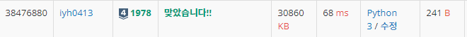

# [Baekjoon] 1978. 소수찾기[S4]

문제: https://www.acmicpc.net/problem/1978

---

주어진 N개 중 소수가 몇 개인지 찾아서 출력하는 프로그램을 만들어야 한다.

소수는 약수가 2개인 수이다.

숫자들을 리스트에 담고 for문을 통해 리스트의 숫자 값들을 순회하면서 하나씩 소수인지 확인한다.

2부터 num-1까지의 수로 순서대로 나누어가며 하나라도 나누어떨어지면 소수가 아니다.

1은 소수가 아닌데 소수라고 출력되니 따로 조건문으로 처리한다.

---

코드:

```python
N = int(input())
nums = list(map(int,input().split()))
cnt = 0
for num in nums:
    if num == 1:    # 1은 소수가 아니다!
        continue
    else: 
        for i in range(2, num): # 2부터 num-1까지의 수 중 하나라도 나누어 떨어지면 소수가 아니다.
            if num % i == 0:
                break
        else: cnt += 1  # 위에서 안 나누어 떨어지면 소수
print(cnt)
```

---

결과:

