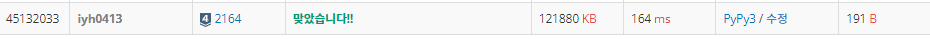

# [Baekjoon] 2164. 카드2 [S4]

## 📚 문제 : [카드2](https://www.acmicpc.net/problem/2164)

## 📖 풀이

규칙

1. 맨 위 카드를 버린다.
2. 그 다음 카드를 맨 아래로 보낸다.
3. 마지막에 남게 되는 카드를 구하라!

위에서 빼고 뒤로 넣어주는 작업을 반복해야 하니 **큐**를 활용해야한다.

python의 deque()를 활용해서 구한다.

while 반복문을 돌리면서 큐에 하나 담길 때까지 반복한다.

popleft()로 맨 왼쪽의 수를 빼고, popleft() 두번째 수를 꺼낸 후 그 수는 다시 append()로 오른쪽에 넣어준다.

## 📒 코드

```python
from collections import deque


n = int(input())
que = deque()
for i in range(1, n + 1):
    que.append(i)

while len(que) != 1:
    que.popleft()
    que.append(que.popleft())

print(que[0])
```

## 🔍 결과

