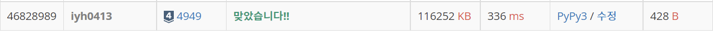

# [Baekjoon] 4949. 균형잡힌 세상 [S4]

## 📚 문제 : [균형잡힌 세상](https://www.acmicpc.net/problem/4949)

## 📖 풀이

괄호 문제로 스택으로 해결한다.

여는 괄호가 나오면 스택에 쌓고, 닫는 괄호가 나오면 스택에서 꺼내 같은 괄호인지 확인한다.

다른 괄호이면 no를 출력한다.

닫는 괄호가 나왔는데 스택에 여는 괄호가 없어도 no를 출력한다.

모든 문자열을 확인했는데 스택에 여는 괄호가 남아있어도 no를 출력한다.

나머지는 정상적으로 괄호가 열고 닫혔으니 yes를 출력한다.

## 📒 코드

```python
while True:
    string = input()
    if string[0] == '.':
        break
    stack = []
    result = 'yes'
    for c in string:
        if c in '([':
            stack.append(c)
        if c == ')':
            if not stack or stack.pop() != '(':
                result = 'no'
        if c == ']':
            if not stack or stack.pop() != '[':
                result = 'no'
    if stack:
        result = 'no'
    print(result)
```

## 🔍 결과

