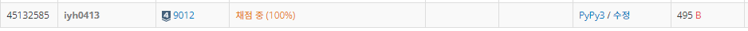

# [Baekjoon] 9012. 괄호 [S4]

## 📚 문제 : [괄호](https://www.acmicpc.net/problem/9012)

## 📖 풀이

**스택**으로 해결한다.

스택에 열린 괄호를 쌓고 닫힌 괄호가 나오면 스택에서 하나씩 제거한다.

열린 괄호가 없는데 닫힌 괄호가 나오면 안된다. 그리고 마지막에는 스택에 아무것도 없어야 한다.

## 📒 코드

```python
def check():
    stack = []
    for x in ps:
        if x == '(':    # 열린 괄호는 스택에 넣는다.
            stack.append(x)
        else:
            if stack:
                stack.pop()
            else:       # stack에 없는데 꺼내려고 하면 VPS가 아니다.
                return 'NO'
    if stack:
        return 'NO'
    else:
        return 'YES'

n = int(input())
for _ in range(n):
    ps = input()        # 입력으로 받은 괄호 문자열
    print(check())
```

## 🔍 결과

