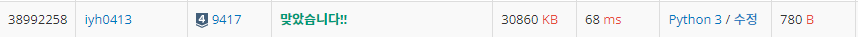

## [Baekjoon] 9417. 최대 GCD [S4]

## 📚 문제

링크 : https://www.acmicpc.net/problem/9417

---

주어진 입력에서 조합을 이용해 2개씩 골라준다.

최대 공약수는 **유클리드 호제법**을 사용한다.

## 📒 코드

```python
T = int(input())
for tc in range(T):
    num_lst = list(map(int, input().split()))
    max_gcd = 0 # 구한 가장 큰 최대 공약수
    for i in range(len(num_lst)):    # 중복되지 않는 두 수를 고르기 위해 중첩 for 문을 사용
        for j in range(i+1, len(num_lst)):
            if num_lst[i] >= num_lst[j]:  # 두 수 중 a에 작은 수를 담는다.
                a, b = num_lst[j], num_lst[i]
            else:
                a, b = num_lst[i], num_lst[j]
            while b % a != 0:   # 유클리드 호제법을 사용해 최대 공약수를 구한다.
                a, b = b % a, a
            if max_gcd < a: # 최대 공약수가 구했던 가장 큰 최대 공약수보다 크면 업데이트
                max_gcd = a
    print(max_gcd)
```

## 🔍 결과



최대 공약수, 최소 공배수는 유클리드 호제법을 활용해 간단하게 해결한다.