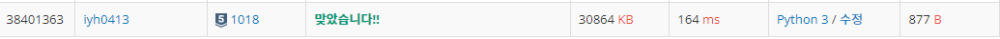

# [Baekjoon] 1018. 체스판 다시 칠하기[S5]

문제 : https://www.acmicpc.net/problem/1018

---

W, B를 1, 0로 바꿔서 받는다.

보드판만큼 맨 왼쪽 위가 1로 시작하는 것과 0으로 시작하는 것으로 2가지 큰 체스판을 만든다.

리스트 컴프리헨션 적극 활용. lambda if문 활용한다.

코드 :

```python
height, width = map(int, input().split()) # 보드판의 세로, 가로
# W와 B를 1과 0으로 변경하여 2차원 list에 넣는다.
chess = [list(map(lambda x: 1 if x == 'W' else 0, input())) for _ in range(height)] 
# 맨 왼쪽 위를 1로 시작하는 체스판, 보드판만큼 다 채운다.
correct_chess1 = [[0 if (i+j) % 2 else 1 for j in range(width)]for i in range(height)]  
# 맨 왼쪽 위를 0으로 시작하는 체스판, 보드판만큼 다 채운다.
correct_chess2 = [[1 if (i+j) % 2 else 0 for j in range(width)]for i in range(height)]  
```

---

입력된 보드판을 8x8로 필터링 시키면서 2가지 체스판과 비교해 가장 차이가 적은 하나를 고른다.

코드:

```python
for i in range(height-7):   # 체스판을 8x8로 필터링할 for 문
    for j in range(width-7):    # 체스판을 8x8로 필터링할 for 문
        cnt1 = 0 
        cnt2 = 0
        for k in range(8):
            for l in range(8):
                if correct_chess1[i+k][j+l] != chess[i+k][j+l]:
                    cnt1 += 1   # chess1과 비교, 다르면 1씩 더한다.
                if correct_chess2[i+k][j+l] != chess[i+k][j+l]:
                    cnt2 += 1   # chess2와 비교
        if cnt_min > cnt1 : cnt_min = cnt1  # 가장 효율적인지 체크
        if cnt_min > cnt2 : cnt_min = cnt2

print(cnt_min)
```

---

최종 코드:

```python
height, width = map(int, input().split()) # 보드판의 세로, 가로
# W와 B를 1과 0으로 변경하여 2차원 list에 넣는다.
chess = [list(map(lambda x: 1 if x == 'W' else 0, input())) for _ in range(height)] 
# 맨 왼쪽 위를 1로 시작하는 체스판, 보드판만큼 다 채운다.
correct_chess1 = [[0 if (i+j) % 2 else 1 for j in range(width)]for i in range(height)]  
# 맨 왼쪽 위를 0으로 시작하는 체스판, 보드판만큼 다 채운다.
correct_chess2 = [[1 if (i+j) % 2 else 0 for j in range(width)]for i in range(height)]  
cnt_min = height * width    # 출력할 가장 조금 칠할 수 있는 경우의 수, 최고 값으로 초기화

for i in range(height-7):   # 체스판을 8x8로 필터링할 for 문
    for j in range(width-7):    # 체스판을 8x8로 필터링할 for 문
        cnt1 = 0 
        cnt2 = 0
        for k in range(8):
            for l in range(8):
                if correct_chess1[i+k][j+l] != chess[i+k][j+l]:
                    cnt1 += 1   # chess1과 비교, 다르면 1씩 더한다.
                if correct_chess2[i+k][j+l] != chess[i+k][j+l]:
                    cnt2 += 1   # chess2와 비교
        if cnt_min > cnt1 : cnt_min = cnt1  # 가장 효율적인지 체크
        if cnt_min > cnt2 : cnt_min = cnt2

print(cnt_min)
```


---

결과:



for문을 4번 통과하기 때문에 시간초과가 뜰 줄 알았지만 예상외로 통과했다.