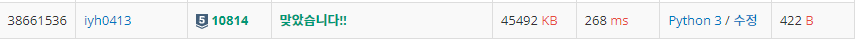

# [Baekjoon] 10814. 나이순 정렬 [S5]

## 📚 문제

https://www.acmicpc.net/problem/10814

---

정렬하는 문제이다. 나이와 이름을 tuple로 묶어서 나이로 정렬한다.

입력이 100000개까지 들어오니 `sys.stdin.readline`을 사용한다.

`.sort(key = )` 메서드를 활용해 key에 첫번째 인덱스를 고르는 함수를 lambda 표현식을 활용해 만들어준다.

tuple을 언팩 연산자로 괄호를 제거해주고 문제가 의도하는 모양으로 출력한다.

## 📒 코드

```python
import sys
input = sys.stdin.readline  # 입력이 100000까지 들어온다.

N = int(input())
lst = []
for i in range(N):  # 나이와 이름을 tuple로 담는데 나이는 정수형으로 변환
    age, name = input().split()
    lst.append((int(age), name))

lst.sort(key=lambda x: x[0]) # tuple의 0번째 인덱스로 정렬

for i in range(N):
    print(*lst[i])  # 언팩연산자로 tuple의 ()제거 후 출력
```

## 🔍 결과

