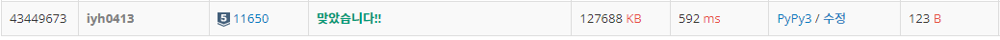

# [Baekjoon] 11650. 좌표 정렬하기 [S5]

## 📚 문제 : [좌표 정렬하기](https://www.acmicpc.net/problem/11650)

## 📖 풀이

첫번째 수로 오름차순 정렬하고, 같으면 두번째 수로 오름차순 정렬하여 출력한다.

순서대로 정렬하니 그냥 `sort()`를 사용하면 된다.

## 📒 코드

```python
n = int(input())
arr = [list(map(int, input().split())) for _ in range(n)]
arr.sort()
for i in range(n):
    print(*arr[i])
```

## 🔍 결과

