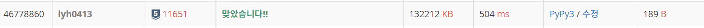

# [Baekjoon] 11651. 좌표 정렬하기 2 [S2]

## 📚 문제 : [좌표 정렬하기 2](https://www.acmicpc.net/problem/11651)

## 📖 풀이

정렬 문제이다.

y좌표 순으로 오름차순으로 정렬하고 2순위로 x좌표 순으로 오름차순 정렬한다.

sort함수를 활용하는데 `arr.sort(key=lambda x: (x[1], x[0]))` lambda로 원하는 순서대로 정렬시킬 수 있다.

## 📒 코드

```python
import sys
input = sys.stdin.readline

n = int(input())
arr = [list(map(int, input().split())) for _ in range(n)]

arr.sort(key=lambda x: (x[1], x[0]))
for i in range(n):
    print(*arr[i])
```

## 🔍 결과

