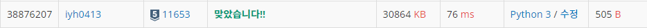

# [Baekjoon] 11653. 소인수분해 [S5]

## 📚 문제

https://www.acmicpc.net/problem/11653

---

소수를 구하거나 소인수 분해를 구할 땐 **제곱근**을 생각하는 것이 매우 중요하다.

소인수 분해에서는 구할 정수의 제곱근 이상의 값이 하나 나오거나 안 나온다.

## 📒 코드

```python
N = int(input())

mok = N
for i in range(2, N+1): # 소인수는 2부터 나누며 구한다.
    
    if i * i > N:   # 소인수가 수의 제곱근보다 큰 경우는 한가지 밖에 안나온다.
                    # 하나만 나오거나 없으니까 1이거나 현재 mok이 나머지 소인수가 된다.
        break

    while mok % i == 0: # 나누어 떨어지면 소인수니 출력한다.
        mok //= i   # 나누어서 수를 줄인다.
        print(i)

if mok != 1:
    print(mok)
```

## 🔍 결과

