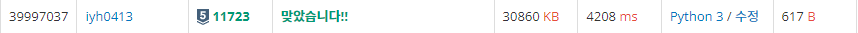

# [Baekjoon] 11723. 집합[S5]

## 📚 문제

https://www.acmicpc.net/problem/11723

---

**집합** 자료형을 활용한 문제이다.

**set()**를 사용해서 나타낸다.

입력이 3백만개까지 주어질 수 있으니 꼭 sys.stdin.readline()를 사용한다.

입력을 tuple로 받고 입력의 길이가 2일 때는 뒤에 숫자가 붙은 걸로 확인한다.

숫자는 꼭 int형으로 변환하여 계산한다.

## 📒 코드

```python
import sys

n = int(input())
s1 = set()
for _ in range(n):
    x = tuple(sys.stdin.readline().split())
    if len(x) == 2:
        if x[0] == 'add':
            s1.add(int(x[1]))
        elif x[0] == 'remove':
            s1.discard(int(x[1]))
        elif x[0] == 'check':
            if int(x[1]) in s1:
                print(1)
            else:
                print(0)
        else:
            if int(x[1]) in s1:
                s1.discard(int(x[1]))
            else:
                s1.add(int(x[1]))
    else:
        if x[0] == 'all':
            s1 = set(range(1, 21))
        else:
            s1 = set()
```

## 🔍 결과

