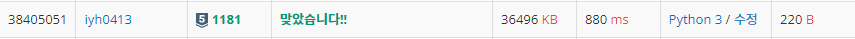

# [Baekjoon] 단어정렬[S5]

문제: https://www.acmicpc.net/problem/1181

---

**문자열도 `sort(), .sorted()`에 적용 가능하다.**그런데 그냥 적용하면 길이 상관없이 사전순으로 배열되니 길이에 맞게 먼저 나누어준다.

입력 문자열을 문자열의 길이를 인덱스로 하는 2차원 배열에 하나씩 담는다.

코드:

```python
cnt_input = int(input())
len_lst = [list() for _ in range(51)]   # 1차원 인덱스가 길이인 리스트에 문자열을 2차원에 담는다.
for _ in range(cnt_input):
    string = input()
    length = len(string)
    if string not in len_lst[length]:   # 중복된 값은 제거한다.
        len_lst[length].append(string)

for lst in len_lst:
    if len(lst):
        # sorted함수로 분류하여 join메서드로 문자열 사이에 개행문자를 넣고 print한다.
        print('\n'.join(sorted(lst)))
```

결과:


흠.. 속도가 뭔가 많이 느리다. tuple로 문자열과 길이를 묶어서도 한 번 풀어본다.

---

이번엔 문자열의 길이와 문자열을 튜플로 담는다.

그리고 **set()**를 사용해 중복을 제거하고, 다시 list로 형변환하여 **sorted()**로 정렬한다.

list를 for문으로 순회하는데 **tuple 객체**를 값으로 받아와 길이가 아닌 문자열만 출력한다.

코드:

```python
cnt_input = int(input())
strings = []
for i in range(cnt_input):  # 문자열의 길이와 문자열을 튜플로 담는다.
    string = input()
    length = len(string)
    strings.append((length, string))

strings = sorted(list(set(strings)))    # 문자열을 set()로 형변환해 중복제거해주고
                                        # 다시 list로 변환 후 sorted함수로 정렬
for l, s in strings:    # strings를 순회하며 tuple 값을 받아와 문자열만 출력
    print(s)
```

결과:



속도가 많이 개선되었다. 만족~

for문에서 tuple 객체로 값을 받아올 수 있음을 알았다!!