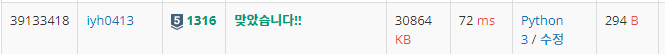

# [Baekjoon] 1316. 그룹 단어 체커 [S5]

## 📚 문제

https://www.acmicpc.net/problem/1316

---

다른문자열들을 사이에 두고 똑같은 문자가 또 나오지 않는지 체크하는 문제이다.(같은 문자는 연속으로 나와도 된다.)

string이 들어오면 맨 앞 index부터 하나씩 확인한다.

새로운 값이 들어오면 **set 연산자**에 담아 나중에 새로운 값이 또 들어오면 확인한다. 그리고 연속으로 같은 문자가 나오면 넘어가기 위해 하나의 변수에 담는다.

이전의 문자와 같은 문자가 나오면 넘어간다.

새로운 문자가 나오면 set에 담은 문자들과 비교해, 똑같은 문자가 있으면 false이니 cnt를 1 줄인다.

set에 똑같은 문자가 없으면 추가하고, 연속인 문자를 확인해주는 변수에 새로 담아준다.

cnt는 처음에 전체 문자수로 초기화하고 잘못된 문자가 나올 때마다 cnt를 1 줄이고 break 문으로 다음 문자 탐색으로 넘어간다.

## 📒 코드

```python
N = int(input())
cnt = N
for _ in range(N):
    appear = set()  # 연속된 문자가 아닐 때 그 이전에 나왔던 문자들과 비교
    string = input()
    before = '' # 이전에 나온 문자 저장하는 변수
    for i in string:
        if i != before:         # 연속된 문자인지 확인
            before = i          # 새로운 단어로 연속된 문자인지 확인하는 변수를 바꿔준다.
            if {i} & appear:    # 이전에 나왔던 문자와 같은게 있을 때
                cnt -= 1        # 그룹 단어가 아니므로 감소
                break
            else: appear = appear | {i} # 이전에 나왔던 문자가 아니니 appear에 추가해준다.
print(cnt)
```

## 🔍 결과

