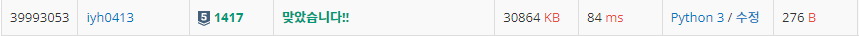

# [Baekjoon] 1417. 국회의원 선거 [S5]

## 📚 문제

https://www.acmicpc.net/problem/1417

---

평탄화 문제와 비슷하다. 

다솜이보다 득표수가 많거나 같은 후보의 득표를 하나 줄이고 다솜이의 득표를 하나 추가한다. 득표를 추가할 때마다 cnt를 추가시켜준다.

다솜이가 가장 득표수가 많으면 중단하고 cnt를 출력한다.

## 📒 코드

```python
n = int(input())
arr = [int(input()) for _ in range(n)]  # 다솜이와 나머지 사람의 득표수
cnt = 0     # 매수한 사람의 수

while True:
    max = 0
    for i in range(n):
        if arr[i] >= arr[max]:  # 가장 득표수가 많은 후보 선택
            max = i
    if max:                 # 다솜이보다 득표수가 많은 사람이 있을 때
        cnt += 1            # 매수
        arr[0] += 1         # 다솜이의 득표수 +1
        arr[max] -= 1       # 득표수가 많은 후보의 득표수 -1
    else:
        print(cnt)          # 매수한 사람의 수 출력
        break
```

## 🔍 결과



