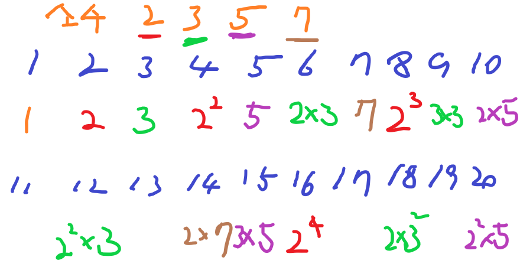
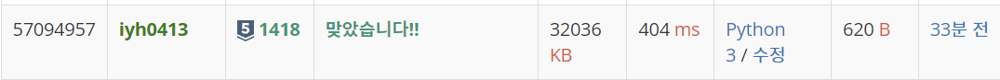

# [Baekjoon] 1418. K-세준수 [S5]

## 📚 문제 : [K-세준수](https://www.acmicpc.net/problem/1418)

## 📖 풀이

소인수의 최댓값을 구해야하는 문제이다.

따라서 우선 소수를 구한다.

### 소수 구하기

에라토스테네스의 체를 활용한다.

k개의 배열을 만들어 2부터 확인한다.

확인한 수가 방문표시 되어있지 않으면 방문표시 하면서 소수의 배열에 담는다.

현재 수의 배수들도(k까지) 전부 담아준다.

이런 식으로 확인해 담아주면 소수들만 구할 수 있다.

### 구한 소수들의 곱으로만 이루어진 수 찾기

n개의 배열을 만들어 방문표시 한다.

1은 무조건 담기는 K-세준수라 방문표시 해준다.

소수 배열들을 순회하면서 n개의 수를 확인한다. 현재 확인한 수를 소수로 나눴을 때 방문표시 한 수라면(내가 가진 소수 배열로 구한 수) 현재 확인한 수도 또한 소수 배열로 구한 수라는 의미이다.

이걸 활용해 구해준다.

그럼 아래처럼 구해볼 수 있다.

n이 20, k가 10일 때의 결과이다.



소수는 2, 3, 5, 7이고

2부터 순차적으로 방문표시한다.

현재 나온 모든 수에 해당 수를 곱해 n 이하이면 방문표시한다.

그럼 위와 같이 방문표시 되므로 방문표시된 개수를 구하면 16이 된다.

## 📒 풀이

```python
# n이하의 자연수 중 k-세준수를 찾아라
n = int(input())
k = int(input())
# 현재 k이하의 소수 담기!
# 에라토스테네스의 체로 소수를 구한다.
sosu = []
temp = [0 for _ in range(k + 1)]
for i in range(2, k + 1):
    if temp[i] == 0:
        sosu.append(i)
        for j in range(i, k + 1, i):
            temp[j] = 1
# print(sosu)   # 소수의 집합

visited = [False for _ in range(n + 1)]
visited[1] = True   # 1을 넣어준다.
for i in sosu:
    for j in range(1, n + 1):
        # 이미 조합된(확인한) 수인지 보고 방문표시 해준다.
        if (j // i) > 0 and j % i == 0 and visited[j // i] is True:
            visited[j] = True

print(sum(visited))
```

## 🔍 결과

