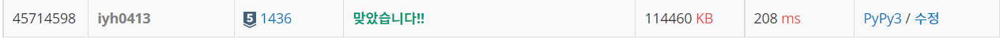

# [Baekjoon] 1436. 영화감독 숌 [S5]

## 📚 문제 : [영화감독 숌](https://www.acmicpc.net/problem/1436)

## 📖 풀이

1부터 수를 더하면서 6이 연속으로 3개 들어갈 때마다 cnt를 1 증가시킨다.

cnt가 입력된 n과 같을 때 그 수를 출력한다.

666이 연속으로 들어갔는지 확인하기 위해 수를 string으로 형변환으로 하고 '666'이 속해있는지 확인하면 된다.

## 📒 코드

```python
n = int(input())

cnt = 1
number = 666
while n > cnt:
    number += 1
    six_cnt = 0
    if '666' in str(number):
        cnt += 1
print(number)
```

## 🔍 결과

