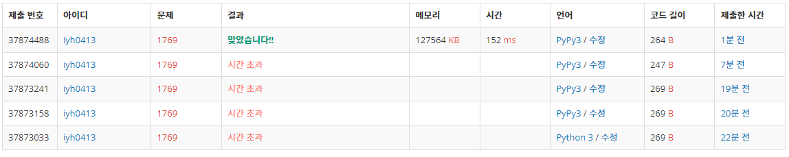

# [baekjoon] 1769. 3의 배수[S5]

## 📚 문제

https://www.acmicpc.net/problem/1769

---

**재귀함수**를 연습

3의 배수는 자릿수를 더한 값도 3의 배수라는 걸 이용하여 해결하라는 문제이다. 

함수에 입력이 10 이상이면 각 자리 수를 더해서 다시 함수로 들어도록 재귀함수로 짠다.

함수를 호출할 때마다 cnt를 증가시켜주기 위해 전역 변수로 선언하고 global함수로 불러와 사용한다.

## 📒 시간 초과 코드

```python
# 시간 초과...
X = int(input())
cnt = 0
def check_three(num):
    global cnt
    if num < 10:
        print(cnt)
        if num % 3: print('NO')
        else: print('YES')
    else: 
        cnt += 1
        num = sum(map(int,str(num)))
        return check_three(num) 
check_three(X)
```

시간초과가 발생한다.. 시간 초과를 줄이기 위해 print문을 합치고 cnt도 지역변수로 선언했지만 똑같이 시간초과가 발생한다 ㅜㅜ

입력을 받아서 정수로 바꿔줘서 사용했는데 입력을 문자열로 사용하니까 빠른 속도로 해결..

수가 커질수록 2진수로 표현해야하는 정수 값은 기하급수적으로 커지기 때문인 것 같다!

큰 수가 들어오면 이를 생각하고 해결할 필요성이 있다.

## 📒 최종 코드

```python
def check_three(string,cnt):
    if len(string) == 1:
        if int(string) % 3: print(f'{cnt}\nNO')
        else: print(f'{cnt}\nYES')
    else: 
        cnt += 1
        num = str(sum(map(int,string)))
        return check_three(num,cnt) 
check_three(input(),0)
```

## 🔍 결과



속도도 생각해야 한다.. 머리 아픔!