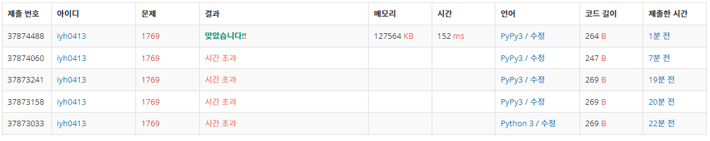

# [baekjoon] 1769. 3의 배수[S5]

| 시간 제한 | 메모리 제한 | 제출 | 정답 | 맞힌 사람 | 정답 비율 |
| :-------- | :---------- | :--- | :--- | :-------- | :-------- |
| 2 초      | 128 MB      | 6738 | 1957 | 1605      | 31.201%   |

## 문제

문제가 잘 풀리지 않을 때, 문제를 바라보는 시각을 조금만 다르게 가지면 문제가 쉽게 풀리는 경험을 종종 해 보았을 것이다. 여러 가지 방법이 있지만 그 중 하나로 우리가 풀고 싶은 문제를 좀 더 쉬운 문제로 바꾸어 풀어 보는 방법이 있다.

소위 "다른 문제로 바꾸어 풀기"라는 이 방법은, 아래와 같은 과정으로 이루어진다.

1. 풀고자 하는 문제를 다른 문제로 변환한다.
2. 변환된 문제의 답을 구한다.
3. 구한 답을 원래 문제의 답으로 삼는다.

이를 보다 쉽게 이해하기 위해서, 다음의 초등학교 수학 수준의 예를 들어 보자.

문제 1. "양의 정수 X는 3의 배수인가?"

이 문제를 아래와 같이 변환하는데, X의 각 자리의 수를 단순히 더한 수 Y를 만든다. 예를 들어 X가 1107이었다면, Y는 1+1+0+7=9가 된다. 그리고 Y에 대해서, 아래와 같은 문제를 생각한다.

문제 2. "Y는 3의 배수인가?"

위의 문제 1의 답은 아래의 문제 2의 대답과 일치한다. 위의 예의 경우, Y=9는 3의 배수이므로 X=1107 역시 3의 배수가 되는 것이다. 214는 각 자리수의 합 2+1+4=7이 3의 배수가 아니므로 3의 배수가 아니다.

문제 1을 풀고 싶으면 문제 2로 변환을 해서 문제 2의 답을 문제 1의 답으로 삼으면 된다. 일반적으로 Y는 X보다 크기가 작으므로, 문제 2가 더 쉬운 문제가 된다.

당신이 알고 있는 3의 배수는 한 자리 수밖에 없다고 가정하자. 즉, 문제 변환의 과정을 여러 번 거치다 보면 Y가 한 자리 수가 되는 순간이 있게 되는데, 그렇게 될 때까지 문제 변환을 반복한다는 뜻이다. 변환 후의 Y가 3, 6, 9 중 하나이면 원래의 수 X는 3의 배수이고, Y가 1, 2, 4, 5, 7, 8 중 하나이면 원래의 수 X는 3의 배수가 아니다.

큰 수 X가 주어졌을 때, 앞에서 설명한 문제 변환의 과정을 몇 번 거쳐야 Y가 한 자리 수가 되어, X가 3의 배수인지 아닌지를 알 수 있게 될지를 구하는 프로그램을 작성하시오.

## 입력

첫째 줄에 큰 자연수 X가 주어진다. X는 1,000,000자리 이하의 수이다. 수는 0으로 시작하지 않는다.

## 출력

첫째 줄에 문제 변환의 과정을 몇 번 거쳤는지를 출력한다. 이 수는 음이 아닌 정수가 되어야 한다. 둘째 줄에는 주어진 수가 3의 배수이면 YES, 아니면 NO를 출력한다.

## 예제 입력 1 복사

```
1234567
```

## 예제 출력 1 복사

```
3
NO
```

---

**재귀함수**를 연습

3의 배수는 자릿수를 더한 값도 3의 배수라는 걸 이용하여 해결하라는 문제이다. 

함수에 입력이 10 이상이면 각 자리 수를 더해서 다시 함수로 들어도록 재귀함수로 짠다.

함수를 호출할 때마다 cnt를 증가시켜주기 위해 전역 변수로 선언하고 global함수로 불러와 사용한다.

```python
# 시간 초과...
X = int(input())
cnt = 0
def check_three(num):
    global cnt
    if num < 10:
        print(cnt)
        if num % 3: print('NO')
        else: print('YES')
    else: 
        cnt += 1
        num = sum(map(int,str(num)))
        return check_three(num) 
check_three(X)
```

시간초과가 발생한다.. 시간 초과를 줄이기 위해 print문을 합치고 cnt도 지역변수로 선언했지만 똑같이 시간초과가 발생한다 ㅜㅜ

입력을 받아서 정수로 바꿔줘서 사용했는데 입력을 문자열로 사용하니까 빠른 속도로 해결..

수가 커질수록 2진수로 표현해야하는 정수 값은 기하급수적으로 커지기 때문인 것 같다!

큰 수가 들어오면 이를 생각하고 해결할 필요성이 있다.

```python
def check_three(string,cnt):
    if len(string) == 1:
        if int(string) % 3: print(f'{cnt}\nNO')
        else: print(f'{cnt}\nYES')
    else: 
        cnt += 1
        num = str(sum(map(int,string)))
        return check_three(num,cnt) 
check_three(input(),0)
```


결과:




속도도 생각해야 한다.. 머리 아픔!