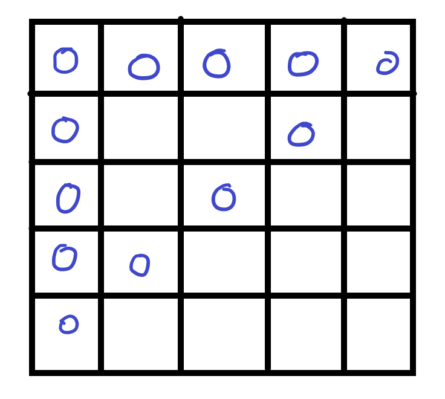
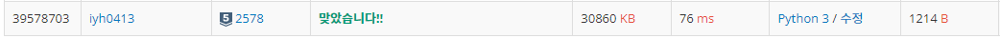

# [Baekjoon] 2578. 빙고 [S5]

## 📚 문제

https://www.acmicpc.net/problem/2578

---

5 X 5 빙고판에서 빙고 3줄이 나오는 순서를 출력하는 문제이다.

선 3개로 가장 많은 접점이 나오는 경우는 3개이다. 따라서 다음 그림과 같이



빙고가 세줄이 되는 가장 빠른 경우는 12번이다.

따라서 12번의 입력을 받아 빙고판에 0으로 표시하고 빙고를 확인한다.

13번째부터는 입력받은 숫자를 0으로 넣어주고 빙고를 확인해준다.

## 📒 코드

```python
def check(): # 빙고 3개 체크
    bingo = 0
    cr1_cnt, cr2_cnt = 0, 0 
    for i in range(5):
        row_cnt, col_cnt = 0, 0
        if arr[i][i] == 0:      # 대각선 아래로 내려오는 방향
            cr1_cnt += 1
        if arr[4-i][i] == 0:    # 대각선 위로 올라가는 방향
            cr2_cnt += 1
        for j in range(5): 
            if arr[i][j] == 0:  # 행방향
                row_cnt += 1
            if arr[j][i] == 0:  # 열방향
                col_cnt += 1
        if row_cnt == 5:    # 행, 열 방향 확인
            bingo += 1
        if col_cnt == 5:
            bingo += 1
    if cr1_cnt == 5:    # 대각선 확인
        bingo += 1
    if cr2_cnt == 5:
        bingo += 1

    if bingo >= 3:      # 빙고 3줄인지 확인
        return True
    else:
        return False


arr = [list(map(int, input().split())) for _ in range(5)]
nums = []
for _ in range(5):
    nums += list(map(int, input().split()))

# 12번째까지 0 넣어주기
for i in range(5):
    for j in range(5):
        if arr[i][j] in nums[:12]:
            arr[i][j] = 0
cnt = 12
nums = nums[12:]    # 12개 없애준다.

if check():         # 빙고 3줄인지 확인
    print(cnt)      # 12번 출력
else:               # 이제 하나씩 넣어가며 확인
    for v in nums:
        cnt += 1
        for i in range(5):  # 빙고판에 0을 넣어준다.
            for j in range(5):
                if arr[i][j] == v:
                    arr[i][j] = 0
        if check(): # 빙고 3줄이면 횟수 출력
            print(cnt)
            break
```

## 🔍 결과



빙고 3개 체크하는 코드는 길지만 완료..