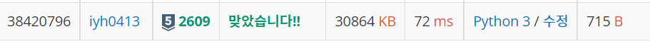

# [Baekjoon] 2609. 최대공약수와 최소공배수[S5]

문제: https://www.acmicpc.net/problem/2609

---

최대공약수와 최소공배수 각각 계산하는 함수를 만든다.

1. 최대공약수는 먼저 두 수 중 작은 수를 고른다. 

   작은 수부터 1까지 순서대로 두 수를 나누어본다. 

   %연산을 했을 때, 둘 다 0이 나왔을 때 반환한다. 중간에 결과가 나오면 반환한다.

   a,b 두 수가 입력되면 아무리 늦어도 최대공약수로 1이 반환된다.

코드:

```python
def max_gongyaksoo(num1, num2): # 최대공약수 구하기
    if num1 < num2: # 작은 수를 고른다
        small_num = num1
    else: small_num = num2

    for i in range(small_num,0,-1): # 작은 수에서 1씩 줄여가며 최대공약수를 찾는다.
        if (num1 % i == 0) and (num2 % i == 0):
            return i
```

---

2. 최소공배수는 두 수의 배수를 비교해본다. 같을 때 출력!

   두 수 중 작은 수는 입력된 숫자를 더한다. 계속 반복 후 같아지면 반환한다.

   a ,b 두 수가 입력되면 아무리 늦게 나와도 a*b가 만들어질 땐 최소 공배수가 나온다.

코드:

```python
def min_gongbaesoo(num1, num2): # 최소공배수 구하기
    num1_mul = num1
    num2_mul = num2
    while True:
        if num1_mul == num2_mul:
            return num1_mul
        elif num1_mul > num2_mul:
            num2_mul += num2
        else: num1_mul += num1
```

---

최종 코드:

```python
num1, num2 = map(int, input().split())

def max_gongyaksoo(num1, num2): # 최대공약수 구하기
    if num1 < num2: # 작은 수를 고른다
        small_num = num1
    else: small_num = num2

    for i in range(small_num,0,-1): # 작은 수에서 1씩 줄여가며 최대공약수를 찾는다.
        if (num1 % i == 0) and (num2 % i == 0):
            return i
    
def min_gongbaesoo(num1, num2): # 최소공배수 구하기
    num1_mul = num1
    num2_mul = num2
    while True:
        if num1_mul == num2_mul:
            return num1_mul
        elif num1_mul > num2_mul:
            num2_mul += num2
        else: num1_mul += num1

print(max_gongyaksoo(num1, num2))
print(min_gongbaesoo(num1, num2))
```

결과:



