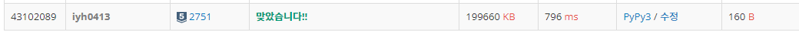

# [Baekjoon] 2751. 수 정렬하기 2 [S5]

## 📚 문제 : [수 정렬하기 2](https://www.acmicpc.net/problem/2751)

## 📖 풀이

배열에 수를 다 담는다.

sort 함수로 오름차순으로 정렬 후 출력한다.

## 📒 코드

```python
import sys
input = sys.stdin.readline

n = int(input())
arr = []
for i in range(n):
    arr.append(int(input()))
arr.sort()
for i in range(n):
    print(arr[i])
```

## 🔍 결과

