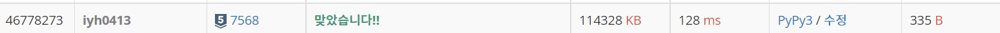

# [Baekjoon] 7568. 덩치 [S5]

## 📚 문제 : [덩치](https://www.acmicpc.net/problem/7568)

## 📖 풀이

두 명씩 매칭하여 키와 몸무게 둘 다 더 작은 쪽의 덩치 등수를 1씩 늘린다. 따라서 완전 탐색으로 O(n^2)으로 해결하는 것인데 n이 50이니까 충분하다.

각 사람의 덩치 등수를 적을 리스트를 하나 만든다. 덩치 등수는 다 1에서 시작한다.

## 📒 코드

```python
n = int(input())
arr = [list(map(int, input().split())) for _ in range(n)]

rnk = [1 for _ in range(n)]
for i in range(n):
    for j in range(i + 1, n):
        if arr[i][0] < arr[j][0] and arr[i][1] < arr[j][1]:
            rnk[i] += 1
        elif arr[i][0] > arr[j][0] and arr[i][1] > arr[j][1]:
            rnk[j] += 1

print(*rnk)
```

## 🔍 결과

