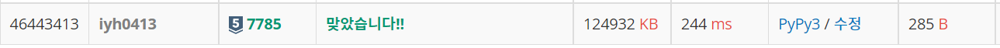

# [Baekjoon] 7785. 회사에 있는 사람 [S5]

## 📚 문제 : [회사에 있는 사람](https://www.acmicpc.net/problem/7785)

## 📖 풀이

**Set 자료형**을 활용한다.

입력이 1000000이다. 따라서 O(n^2)이면 시간초과가 발생한다.

먼저 입력받은 로그를 순회하는데 드는 시간 복잡도가 O(n)이다.

list로 사용자들을 넣고 빼면 넣는 건 O(1)이라 괜찮은데 remove 연산이 O(n)이다.

그러면 입력받은 로그를 순회하는 시간 복잡도 X remove 연산 복잡도 = O(n ^ 2) 이라 시간 초과이다.

따라서 set()를 사용한다.

set 자료형은 해시 테이블이라 search하는데 O(1)이다. 따라서 remove 연산도 O(1)이다.

set를 쓰면 총 O(n)이 되어 시간 안에 돌게 된다.

## 📒 코드

```python
import sys
input = sys.stdin.readline

n = int(input())

company = set()
for i in range(n):
    name, state = input().split()
    if state == 'enter':
        company.add(name)
    else:
        company.remove(name)

for person in sorted(list(company), reverse=True):
    print(person)
```

## 🔍 결과

