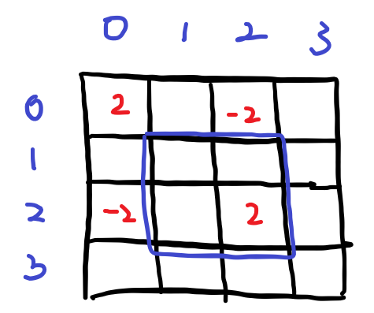
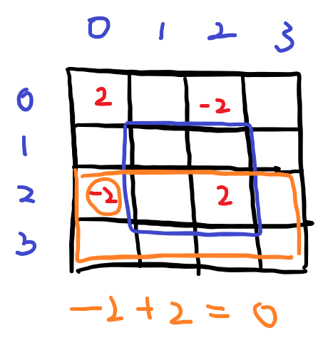
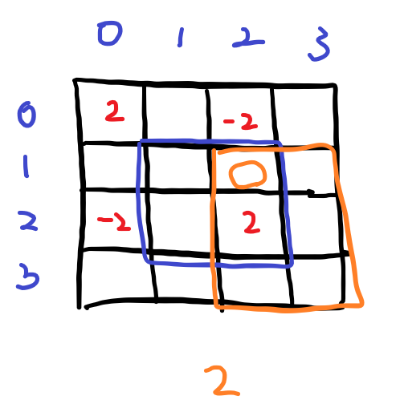

# [Programmers] Lv 3. 파괴되지 않는 건물 [2022 KAKAO BLIND RECRUITMENT]

## 📚 문제 : [파괴되지 않는 건물](https://school.programmers.co.kr/learn/courses/30/lessons/92344)

## 📖 풀이

2차원 **누적합**으로 해결한다.

누적합을 하기 위해 값을 넣어준다. 각각의 꼭짓점을 기준으로 넣어주면 된다.

1. 회복 스킬을 사용했을 때

   범위가 (1, 1) => (2, 2), degree = 2 일 때

   

   오른쪽 아래 꼭짓점에 degree를 넣고 시작지점 왼쪽 대각선 위에도 넣어준다.

   위처럼 쓴 경우 답을 구하는 방법은 각각의 해당 좌표 기준 (3, 3)과 연결한 사각형 안의 값들의 합이 각 좌표의 degree 값이다.

2. 공격 스킬을 사용했을 때

   위와 같은데 degree만 반대로 적어주면 된다.

모든 스킬을 위처럼 구해주면 O(n)이다.

---

이제 각 구간별로 오른쪽 아래 사각형 안의 모든 숫자의 합을 더해주면 된다.

위 그림 기준으로 확인해보자.

1. (0, 2)를 확인하면

   

   좌표 기준 오른쪽 아래 꽉채우는 사각형의 모든 수들을 더해주면 0이다.

   이는 파란색 박스 밖이므로 0이 나와야 하니 동일하다.

2. (1, 2)를 확인하면

   

   주황색 박스 안의 숫자는 2만 있으므로 좌표의 값은 2이다.

   이 때 파란색 박스 안이므로 2가 나와야 하니 맞다.

위처럼 구하면 모든 스킬에 영향받은 각 좌표를 구할 수 있다.

오른쪽 아래 기준으로 박스가 그려지므로, 누적합을 활용한다.

거꾸로 (n, n)부터 (0, 0)까지 순회하며 현재 좌표값 + 오른쪽 값 + 아래쪽 값 - 오른쪽 아래 값을 해준다.

> `prefix_sum[i][j] += prefix_sum[i][j + 1] + prefix_sum[i + 1][j] - prefix_sum[i + 1][j + 1]`

다음과 같이 누적합으로 해결하면 각 좌표 별로 사각형 안의 숫자들을 다 일일히 더해주지 않고 O(n^2)으로 해결할 수 있다.

## 📒 코드

```python
def solution(board, skill):
    n = len(board)
    m = len(board[0])
    # 2차원 누적합 활용
    prefix_sum = [[0] * (m + 1) for _ in range(n + 1)]
    
    # 2차원 누적합 구하기
    for i in range(len(skill)):
        degree = skill[i][5]     # 가중치
        if skill[i][0] == 1:     # 공격
            degree = - degree    # 공격일 땐 음수
        # (r1 - 1, c1 - 1) 에 degree 더한다.
        if skill[i][1] and skill[i][2]:
            prefix_sum[skill[i][1] - 1][skill[i][2] - 1] += degree
        # (r1 - 1, c2) 에 degree를 뺀다.
        if skill[i][1]:
            prefix_sum[skill[i][1] - 1][skill[i][4]] -= degree
        # (r2, c1 - 1) 에 degree를 뺀다.
        if skill[i][2]:
            prefix_sum[skill[i][3]][skill[i][2] - 1] -= degree
        # (r2, c2) 에 degree를 더한다.
        prefix_sum[skill[i][3]][skill[i][4]] += degree
    
    
    # 각 구간의 파괴당한 정보 기록
    for i in range(n)[::-1]:
        for j in range(m)[::-1]:
            prefix_sum[i][j] += prefix_sum[i][j + 1] + prefix_sum[i + 1][j] - prefix_sum[i + 1][j + 1]
            
    answer = 0
    for i in range(n):
        for j in range(m):
            if board[i][j] + prefix_sum[i][j] > 0:      # 내구도가 낮아졌는지 확인
                answer += 1
    
    return answer
```

