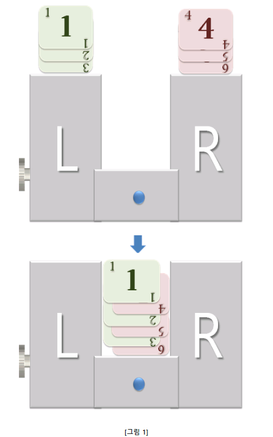
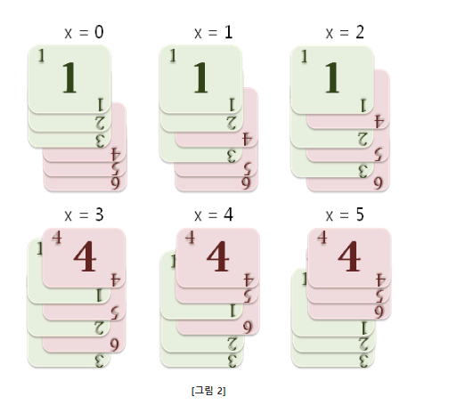
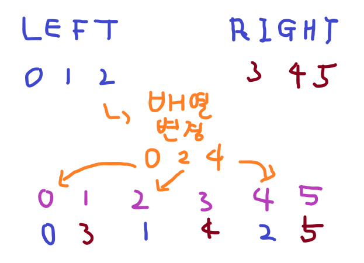
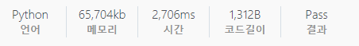

# [SWEA] 15173. [연습문제] Shuffle-O-Matic

## 📚 문제 : Shuffle-O-Matic

**Shuffle-O-Matic** 은 카드의 순서를 섞는데 사용하는, 카드 셔플러이다.

**[그림 1]** 과 같이, 양쪽에 카드를 절반씩 올려놓고, 동작 버튼을 누르면 카드가 가운데로 떨어지면서 섞이게 된다.



이 카드 셔플러는 특이하게도, **카드가 섞이기 시작하는 시점인 x 값을 사용자가 조정할 수 있다.**
카드 셔플러의 사용 방법은 아래와 같다.

 

**1. N 개로 이루어진 덱을 절반으로 나누어 올려둔다.**

1 ~ N/2 번째 카드는 왼쪽 (L), N/2 + 1 ~ N 번째 카드는 오른쪽 (R) 에 올려둔다.


**2. 카드 셔플러의 측면에 있는 다이얼로 x 값을 조정한 후, 동작 버튼을 누른다.**

다이얼로 조정할 수 있는 **x** 값은 **0 ~ N-1** 이며, x 값에 따라 카드가 섞이는 순서가 달라진다.
N = 6이고, 기존 카드의 순서가 오름차순으로 정렬된 상태일 때, 아래 **[그림 2]** 와 같은 순서로 셔플이 된다.

 

**Shuffle-O-Matic** 의 기능을 활용하여, 카드의 순서가 오름차순 또는 내림차순이 되도록 정렬하려고 한다.

**입력으로 N 장의 카드와, 정리되지 않은 상태의 카드 순서가 주어질 때,
최소 몇 번의 셔플로 카드를 정렬할 수 있는지를 계산하는 프로그램을 작성하라.**

정답으로 **오름차순으로 정렬했을 때와 내림차순으로 정렬했을 때 중, 셔플 횟수의 최소값을 출력한다.**

**단, 정렬이 불가능한 경우나 셔플 횟수가 5 회를 초과할 경우, 정답으로 -1 을 출력한다.**

 

**[제약사항]**

1. 카드의 개수 N 은 4 이상 12 이하의 짝수이다. (4 ≤ N ≤ 12)
2. 각각의 카드는 1 ~ N 번까지 숫자가 표기되어 있다.

 

**[입력]**

입력은 첫 줄에 총 테스트 케이스의 개수 T 가 온다. 다음 줄 부터 각 테스트 케이스가 주어진다.
각 테스트 케이스의 첫 줄에는 **카드의 갯수 N** 이 주어진다.
두 번째 줄에는 정렬되지 않은 상태의 카드 번호가 순서대로 나열된다.

 

**[출력]**

테스트 케이스 t에 대한 결과는 “#t”을 찍고, 한 칸 띄고, 정답을 출력한다.
(t는 테스트 케이스의 번호를 의미하며 1부터 시작한다.) 
정답으로 **정렬에 필요한 최소 셔플 횟수**를 출력한다.

---

## 📖 풀이

총 5번까지만 셔플할 수 있다.

한 번 셔플할 때 나올 수 있는 경우의 수는 n이다.

n이 4이상 12이하의 짝수이므로, 완전탐색으로 구하면 O(n ^ 5)이므로 12^5 = 약 25만 정도이다. 25만 정도이니 완전탐색으로 구한다.

### 셔플할 때 나올 수 있는 인덱스 배열 구하기

먼저 셔플할 때 바뀌는 인덱스 값을 구한다.

반대쪽은 순서대로 채워주면 되니 한 쪽만 구한다. 왼쪽과 오른쪽으로 나누어 왼쪽의 인덱스 값을 구해준다.

ex). n = 6인 경우

왼쪽의 배열의 인덱스 값은 [0, 1, 2], 오른쪽은 [3, 4, 5]이다. 여기서 왼쪽의 인덱스 값이 바뀔 수 있는 경우를 다 구한다.

셔플할 때 가질 수 있는 값은

> [0, 1, 3]
>
> [0, 2, 4]
>
> [1, 3, 5]
>
> [2, 4, 5]
>
> [3, 4, 5]

위와 같다.

변하지 않는 경우의 수는 제외한다. => [0, 1, 2]

구하는 규칙을 생각해보면

1. 맨 오른쪽 수는 n // 2번 움직인다.

2. 앞 두 수는 오른쪽 수가 차이가 2인 경우만 움직일 수 있다. 1인 경우는 움직일 수 없다.

두 규칙을 활용해 바뀌는 인덱스 값을 구해 배열에 담아준다.

### 셔플

먼저 현재 배열이 오름차순이나 내림차순인지 확인한다.

- 맞다면 그 때의 셔플 횟수를 리턴한다.

셔플 횟수가 5번을 넘어가면 6을 리턴한다.(-1이 아닌 6을 리턴하는 이유는 가장 적은 셔플 횟수 값을 뽑아내야하는데 -1이 가장 작은 값이 되어버리니 가장 큰 값을 임의로 넣어주는 것이다.)

섞을 때 방법은 위에서 구한 바뀔 인덱스 배열을 확인하여 바꿔준다.

> [0, 1, 3] 인 경우 섞는 방법
>
> 왼쪽 배열이 0, 1, 2에서 0, 1, 3으로 바뀌어야 하니 0부터 n-1까지 순회하며 [0, 1, 3] 배열에 포함되는 값이면 왼쪽 배열의 수를 하나씩 넣어주고, 아니면 오른쪽 배열의 수를 넣는다.

그림으로 설명하면 아래와 같다.



인덱스 값일 때 왼쪽 배열 값을 하나씩 담아주고, 아니면 오른쪽 배열 값을 순서대로 담아나가면 된다.

그러면 우리는 완성되는 경우의 최소 횟수를 출력한다.

## 📒 코드

```python
# 섞을 수 있는 경우의 수를 담는다.
def recur(cur, arr):   # left가 나올 수 있는 경우의 수들의 조합
    temp = arr[:]
    if cur == n - 1:    # 다 구했으니 종료
        return
    for i in range(n // 2):
        if i != n // 2 - 1:     # 마지막 수가 아닌 경우
            if temp[i + 1] - temp[i] > 1:       # 오른쪽 수가 하나 더 큰 지 확인
                temp[i] += 1
        else:                   # 마지막 수인 경우
            if cur < n // 2:
                temp[i] += 1
    orders.append(temp)
    recur(cur + 1, temp)


# 섞기
def shuffle(cur, arr):
    if arr == sorted(arr) or arr == sorted(arr, reverse=True):      # 오름차순이나 내림차순인 경우 횟수를 리턴
        return cur
    if cur == 5:        # 5번까지만 섞는다.
        return INF        # 나올 수 없는 큰 수
    left = arr[:n // 2]
    right = arr[n // 2:]
    ans = INF             # 5번 안에 나오지 않는 경우
    for order in orders:        # 섞을 수 있는 경우를 순회
        result = []
        index_l, index_r = 0, 0
        for i in range(n):
            if i in order:
                result.append(left[index_l])
                index_l += 1
            else:
                result.append(right[index_r])
                index_r += 1
        ans = min(ans, shuffle(cur + 1, result))
    return ans


t = int(input())
INF = 6             # 5번 안에 나오지 않는 경우
for tc in range(1, t + 1):
    n = int(input())
    arr = list(map(int, input().split()))
    visited = [0 for _ in range(n)]
    orders = []         # 섞는 경우 left가 나올 수 있는 경우의 수
    recur(0, list(i for i in range(n // 2)))
    result = shuffle(0, arr)
    # INF는 -1 출력
    print(f'#{tc} {result if result != INF else -1}')
```

## 🔍 결과

