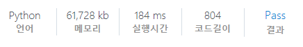

# [SWEA] 1952. [모의 SW 역량테스트] 수영장

## 📚 문제

https://swexpertacademy.com/main/code/problem/problemDetail.do?contestProbId=AV5PpFQaAQMDFAUq

---

## 📖 풀이

순열 문제이다. 

이용권은 4 종류이다.

>  ① 1일 이용권 : 1일 이용이 가능하다.
>
>  ② 1달 이용권 : 1달 동안 이용이 가능하다. 1달 이용권은 매달 1일부터 시작한다.
>
>  ③ 3달 이용권 : 연속된 3달 동안 이용이 가능하다. 3달 이용권은 매달 1일부터 시작한다.
>    (11월, 12월에도 3달 이용권을 사용할 수 있다 / 다음 해의 이용권만을 구매할 수 있기 때문에 3달 이용권은 11월, 12월, 1윌 이나 12월, 1월, 2월 동안 사용하도록 구매할 수는 없다.)
>
>  ④ 1년 이용권 : 1년 동안 이용이 가능하다. 1년 이용권은 매년 1월 1일부터 시작한다.

1년 이용을 했을 경우는 시작할 때 뿐이니 최솟값에 담고 시작한다.

첫 달부터 1일 이용권, 1달 이용권, 3달 이용권을 쓰는 경우 각각 재귀 호출한다.

이 때 1일 이용권과 1달 이용권을 쓰는 경우는 더 최솟값인 경우의 비용을 담는다.

호출하면서 기간을 더해준다. 1일 이용권이나 1달 이용권은 한 달을 더하고, 3달 이용권은 3달을 더한다. 

11월, 12월에도 3달 이용권을 쓸 수 있으니 현재 달이 12월을 넘는 경우 return한다.

## 📒 코드

```python
def recur(cur, fee):
    global min_fee
    if cur > min_fee:       # 현재 요금이 업데이트 된 최소 요금보다 비싸면 return
        return
    if cur >= 12:           # 12개월을 넘어서는 경우
        min_fee = min(min_fee, fee)     # 최소값 업데이트
        return
    if arr[cur] == 0:
        recur(cur + 1, fee)                     # 이용하지 않으면 다음 월로 이동
    else:
        recur(cur + 1, fee + min(mon, day * arr[cur]))    # 당일 요금은 이용 일만큼 곱한다.
        recur(cur + 3, fee + mon_3)             # 3달은 3달을 더해줘야 한다.


for tc in range(1, 1 + int(input())):
    day, mon, mon_3, year = map(int, input().split())
    arr = list(map(int, input().split()))
    min_fee = year      # 1년 요금은 처음에 넣고 최솟값으로 업데이트
    recur(0, 0)
    print(f'#{tc} {min_fee}')
```

## 🔍 결과

