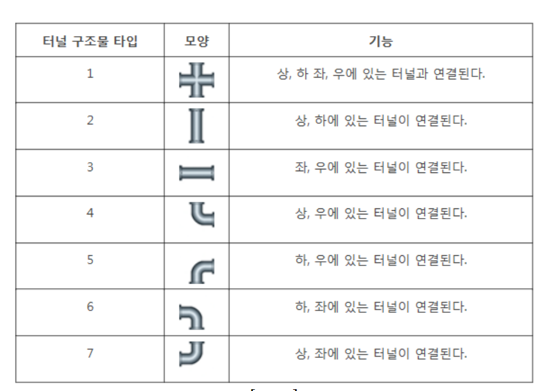
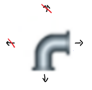
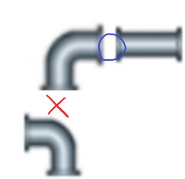

# [SWEA] 1953. [모의 SW 역량테스트] 탈주범 검거

## 📚 문제

https://swexpertacademy.com/main/code/problem/problemDetail.do?contestProbId=AV5PpLlKAQ4DFAUq&categoryId=AV5PpLlKAQ4DFAUq&categoryType=CODE&problemTitle=%ED%83%88%EC%A3%BC%EB%B2%94&orderBy=FIRST_REG_DATETIME&selectCodeLang=ALL&select-1=&pageSize=10&pageIndex=1

---

일정 시간 동안 탐색한 모든 좌표의 개수를 구하는 문제이다.

시간이 주어져있으니 큐를 활용한 **BFS**로 탐색한다.

그냥 탐색하는 것이 아닌 터널의 모양에 따라 움직여야 하므로 구현하기가 조금 빡세다.


주어진 터널의 모양은 다음과 같다.



델타 탐색을 우 하 좌 상 방향으로 탐색할 예정이니, 터널의 모양을 나타낼 배열도 [우, 하, 좌, 상]으로 나타낸다.

- 우하좌상

>1. [1, 1, 1, 1]
>2. [0, 1, 0, 1]
>3. [1, 0, 1, 0]
>4. [1, 0, 0, 1]
>5. [1, 1, 0, 0]
>6. [0, 1, 1, 0]
>7. [0, 0, 1, 1]

큐에서 좌표를 꺼내면 네 방향으로 값을 확인해야 하는데, 터널 모양의 배열에서 그 값이 1인지 확인해서 그 경우만 탐색한다. 따라서 위 터널 모양을 담은 리스트를 만들어준다.

ex). 6번 모양의 터널을 꺼내면 아래와 오른쪽에 연결되어 있는 터널이다.



배열에 우와 하만 1이 표시되어 있으니 0인 좌 상은 탐색하지 않는다.


이동 방향으로 탐색할 때 그 쪽의 터널이 현 위치 쪽으로 뚫려있는지 확인해야 한다.

쉽게 설명하면 현재 터널이 오른쪽으로 뚫려있으면 오른쪽에 있는 터널은 왼쪽이 뚫려있어야 한다.



따라서 방향이 우 하 좌 상이므로 좌 상 우 하로 뚫려있는지 대응되게 확인하면 된다.

`0 1 2 3`이 `2 3 0 1`이랑 대응되야 하므로 2를 더하고 모듈러 연산을 한 값과 같은지 확인한다.


중복 확인하는 경우를 없애기 위해 큐에서 꺼낸 후 배열에 0을 담아 터널을 없애준다.

총 확인한 터널을 따로 세어주기 위해 중복되지 않는 값이 큐에서 나오면 cnt를 1씩 증가시킨다.


시간을 찾아주기 위해 큐에 담을 때 시간도 함께 담는다. 큐에서 꺼내 새로 큐에 담을 때 원래 시간 + 1을 해주고, 주어진 소요시간에 도달했을 경우 cnt만 증가시키고 다음 연결은 확인하지 않고 종료한다.


## 📒 코드

```python
from collections import deque


t = int(input())
for tc in range(1, t + 1):
    n, m, r, c, l = map(int, input().split())   # 전체 크기: n x m, 맨홀: (r, c), 소요 시간: l
    arr = [list(map(int, input().split())) for _ in range(n)]
    # 터널의 모양이 1~7이므로 길이 8인 배열 선언, 각각 우 하 좌 상으로 연결되는지 표시
    tunnel_arr = [0, [1, 1, 1, 1], [0, 1, 0, 1], [1, 0, 1, 0], [1, 0, 0, 1], [1, 1, 0, 0], [0, 1, 1, 0], [0, 0, 1, 1]]
    dy = [0, 1, 0, -1]  # 우 하 좌 상
    dx = [1, 0, -1, 0]
    queue = deque()
    cnt = 0     # 탈주범이 있는 터널의 개수
    queue.append((r, c, 1))    # 맨홀과 시작점의 터널 개수


    while queue:
        y, x, time = queue.popleft()
        if arr[y][x] == 0:  # 확인한 값이면 break
            continue
        cnt += 1        # 새로운 터널이니 1 추가

        tunnel = tunnel_arr[arr[y][x]]  # 현재 터널의 모양
        arr[y][x] = 0       # 확인한 위치는 다시 보지 않기 위해 0으로 바꾼다.

        if time == l:       # 더 이상 진행할 수 없는 시간이니 continue
            continue
        
        for i in range(4):  # 우 하 좌 상 네 방향 확인
            if tunnel[i]:   # 터널이 그쪽 방향으로 뚫려있는지 확인
                ny, nx = y + dy[i], x + dx[i]
                # 이동 방향이 배열을 초과하지 않고, 터널이 있는지
                if 0 <= ny < n and 0 <= nx < m and arr[ny][nx] != 0:
                    # 이동 방향에 반대 방향으로 터널이 뚫려 있는지 
                    # ex). 오른쪽에는 왼쪽이, 아래에는 위쪽이 뚫려야 함.
                    if tunnel_arr[arr[ny][nx]][(i + 2) % 4]:
                        queue.append((ny, nx, time + 1))    # 뚫려있으면 큐에 넣는다.
    print(f'#{tc} {cnt}')
```

## 🔍 결과 : Pass