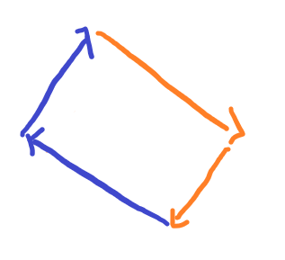

# [SWEA] 2105. [모의 SW 역량테스트] 디저트 카페

## 📚 문제

https://swexpertacademy.com/main/code/problem/problemDetail.do?contestProbId=AV5VwAr6APYDFAWu&categoryId=AV5VwAr6APYDFAWu&categoryType=CODE&problemTitle=%EB%94%94%EC%A0%80%ED%8A%B8+%EC%B9%B4%ED%8E%98&orderBy=FIRST_REG_DATETIME&selectCodeLang=ALL&select-1=&pageSize=10&pageIndex=1

---

## 📖 풀이

재귀를 활용한 백트래킹을 활용한다.

움직이는 방향을 네 방향으로 움직이지 않고 시작점 기준 일정한 방향으로 움직이며 사각형을 그린다.


오른쪽 아래, 왼쪽 아래, 왼쪽 위, 오른쪽 위 방향 순서대로 그리기로 약속한다.

직진하거나 꺾는 것 두 가지 조합으로 재귀를 구현한다.


이 때 꺾을 때마다 방향으로 한 번 이상 움직이고 꺾게끔 해야 한다.

왜냐하면 문제에서 아래와 같이 주어졌다.


그리고 두 번 꺾고 난 이후부터는 직진, 방향 전환의 조합으로 꺾지 않고, 사각형을 그리면 된다.

왜냐하면 이미 두 변이 완성됐기 때문에 직사각형의 길이 정해졌다.


위와 같은 상황에서 꺾으면 나머지 길은 자동으로 정해진다.

아래와 같다.



따라서 cur이 2이상 부터는 조건문을 활용해 다르게 처리해주어야 한다.

나는 cur이 2이면서 y, x의 합이 시작점의 i, j의 합과 다르면 계속 직진하고 아니면 꺾게 설정했다. cur이 3일 때는 시작점과 만나면 되니까 y좌표가 같을 때 출력하도록 했다.

직진하면서 생각해야 하는 점은 똑같은 디저트를 먹지 않아야 한다.

따라서 visited를 선언해 디저트를 먹을 때마다 방문표시를 해준다.

이 때 중요한 점은, 재귀가 끝날 때 visited를 꼭 복구시켜줘야 하는 점이다.

가지치기를 위해 사각형의 두 변이 현재까지 구한 사각형의 두 변보다 작을 때는 확인하지 않도록 구현했다.

## 📒 코드

```python
def moving(d, y, x, cnt):       # 움직이기
    ny = y + dy[d]
    nx = x + dx[d]
    if 0 <= ny < n and 0 <= nx < n and visited[arr[ny][nx]] == 0:
        visited[arr[ny][nx]] = 1        # 방문 표시
        recur(d, ny, nx, cnt + 1, 1)
        visited[arr[ny][nx]] = 0        # 재귀를 빠져 나오면 방문 표시 제거


def recur(cur, y, x, cnt, move):
    global max_cnt
    if cur == 3 and i == y:             # 사각형 완성했을 때
        max_cnt = max(max_cnt, cnt)     # 최댓값 업데이트
        return
    if cur == 2 and max_cnt > cnt * 2:  # 가지치기 두 변의 길이가 현재 값보다 작으면 return
        return
    if cur == 2 and i + j == y + x:     # 두 변을 그린 후부터는 변의 길이에 맞춰 잇는다.
        recur(cur + 1, y, x, cnt, 0)    # 마지막 세번째 꺾고 시작점으로 잇는다.
        return
    # 가던 방향으로 움직인다.
    moving(cur, y, x, cnt)
    # 방향 전환 - 2번까지 임의로 꺾고 3번부터는 사각형을 그리니 임의로 꺾지 않는다.
    if cur < 2 and move:    # 한 번이라도 움직였을 때 꺾는다.
        recur(cur + 1, y, x, cnt, 0)


dy = [1, 1, -1, -1]     # 움직일 순서 : 오른쪽 아래, 왼쪽 아래, 왼쪽 위, 오른쪽 위
dx = [1, -1, -1, 1]
for tc in range(1, 1 + int(input())):
    n = int(input())
    arr = [list(map(int, input().split())) for _ in range(n)]
    visited = [0 for _ in range(101)]       # 중복 확인하기 위함
    max_cnt = 0                             # 출력할 결과

    for i in range(n):          # 모든 점에서 start
        for j in range(n):
            recur(0, i, j, 0, 0)

    if max_cnt == 0:            # 사각형을 그릴 수 없으면 -1 출력
        print(f'#{tc} -1')
    else:
        print(f'#{tc} {max_cnt}')

```

## 🔍 결과

