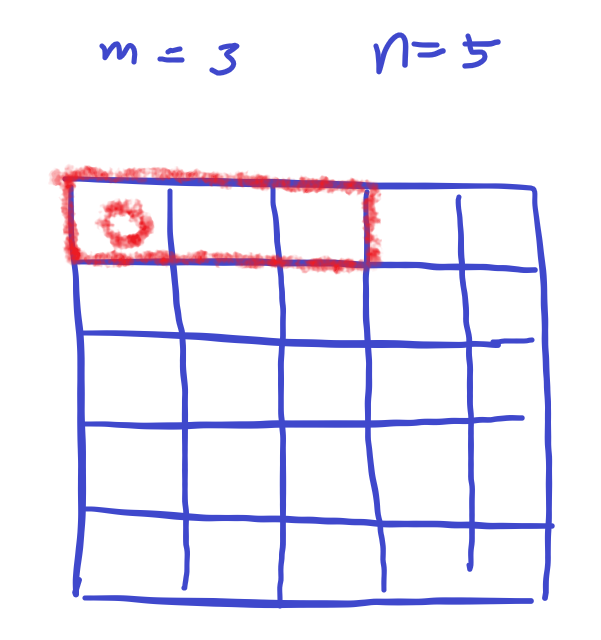

# [SWEA] 2115. [모의 SW 역량테스트] 벌꿀채취

## 📚 문제

https://swexpertacademy.com/main/code/problem/problemDetail.do?contestProbId=AV5V4A46AdIDFAWu&categoryId=AV5V4A46AdIDFAWu&categoryType=CODE&problemTitle=%EB%B2%8C%EA%BF%80%EC%B1%84%EC%B7%A8&orderBy=FIRST_REG_DATETIME&selectCodeLang=ALL&select-1=&pageSize=10&pageIndex=1

---

## 📖 풀이

가로로 연속되게 고를 수도 있는데 제출할 때 가로로 고르게 짜면 fail 뜬다. 제출 검증 케이스를 잘못 만들어 놨는지, 각 줄에서 최대 값만 뽑으면 그게 답이 된다.

일단 같은 라인에서 뽑아도 가능하게 코드를 작성했다.

먼저 현재 인덱스 기준 m의 가장 왼쪽을 차지하고 m칸 중 최대 비용을 배열에 적어준다.

그림으로 보면



네모칸에 있는 값들 중 가장 큰 값을 동그라미에 적어주는 것이다.

이처럼 작성한 후 줄 별로 최댓값을 뽑는다.

그리고 최댓값을 정렬시키고 가장 큰 값과 두번째로 큰 값을 고르면, 줄 별로 최댓값을 뽑는 코드는 완성이다.

한 줄에 2개 뽑을 수 있는 경우도 확인하기 위해, 최댓값을 정렬한 배열에서 가장 큰 값과 같은 값들은 같은 라인에서 최댓값을 갱신시킬 다른 값이 있는지 확인해준다.

그러면 다음과 같은 테스트 케이스도 정상적으로 나온다.

> 1
> 4 2 10
> 1 1 1 1
> 3 3 3 3
> 1 1 1 1
> 1 1 1 1

결과 : 36

## 📒 코드

```python
def recur(cur, total, money):       # 구간에서 최대의 액수 구하기
    global max_money
    if total > c:                   # c보다 크면 리턴
        return
    if cur == m:                    # 구간을 다 확인했으면 최댓값 갱신
        max_money = max(max_money, money)
        return
    # 조합으로 (선택하는 경우와, 선택하지 않는 경우)
    recur(cur + 1, total, money)
    recur(cur + 1, total + temp[cur], money + temp[cur] ** 2)


t = int(input())
for tc in range(1, 1 + t):
    n, m, c = map(int, input().split())
    arr = [list(map(int, input().split())) for _ in range(n)]
    moneys = [[0] * n for _ in range(n)]
    for i in range(n):      # 각 구간별 최댓값을 맨 왼쪽 인덱스에 담아준다.
        for j in range(n - m + 1):
            cnt = 0
            max_money = 0
            temp = arr[i][j:j + m]      # 구간을 배열에 담아 재귀함수로 최대 액수를 찾아준다.
            recur(0, 0, 0)
            moneys[i][j] = max_money

    max_money = []
    max_result = 0
    for i in range(n):          # 각 라인별로 최댓값을 뽑는다.
        max_money.append((max(moneys[i]), i))
    max_money.sort()            # 최댓값을 정렬한다.
    max_result = max_money[-1][0] + max_money[-2][0]        # 정렬하여 큰 순서로 2개 뽑아 더해준다.

    for i in range(1, n + 1):
        if max_money[-i][0] != max_money[-1][0]:  # 정렬한 배열 중 최댓값과 동일한 것이 여러 개 있으면 다 골라준다.  
            break
        index = max_money[-i][1]       # 확인할 라인
        for j in range(n):
            for k in range(j + m, n, m):        # 최댓값이 나오면 바꿔준다.
                max_result = max(max_result, moneys[index][j] + moneys[index][k])

    print(f'#{tc} {max_result}')
```

## 🔍 결과


