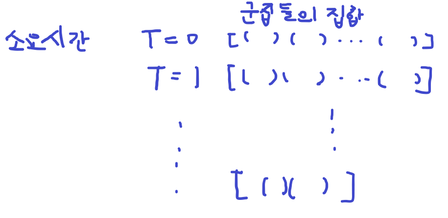

# [SWEA] 2382. [모의 SW 역량테스트] 미생물 격리

## 📚 문제

https://swexpertacademy.com/main/code/problem/problemDetail.do?contestProbId=AV597vbqAH0DFAVl&categoryId=AV597vbqAH0DFAVl&categoryType=CODE&problemTitle=%EB%AF%B8%EC%83%9D%EB%AC%BC&orderBy=FIRST_REG_DATETIME&selectCodeLang=ALL&select-1=&pageSize=10&pageIndex=1

---

## 📖 풀이

2차원 배열의 y축은 시간, x축은 미생물 군집 정보를 담는다.

그림으로 그려보면 다음과 같다.



처음 위치는 배열의 1차원에 담아준다.

이전 시간의 배열을 순회하면서 미생물들의 이동 시킨 후 변화를 현재 배열에 담는다.

시간이 흐를수록 합쳐질 순 있으나 나눠질 순 없어 군집들의 개수는 줄어들거나 같다.

미생물들의 위치가 테두리에 도달했을 때 미생물 수를 줄이고, 이동방향을 반대로 바꿔주는 로직을 조건문을 활용해 짠다.

이 때 현재 배열에 같은 위치의 미생물 군집이 있는지 확인한다.

위치가 같은 미생물의 수는 다 합친다. 

같은 위치에 있으면 미생물의 수가 더 많은 것의 위치로 업데이트한다.

따라서 미생물의 수의 max 값을 따로 변수로 만들어야 한다.

시간이 다 흐른 후 미생물들의 개수를 다 더한다.

## 📒 코드

```python
for tc in range(1, 1 + int(input())):
    n, time, k = map(int, input().split())  # n: 셀의 한 변의 길이, time: 격리 시간, k: 군집의 개수
    arr = [[] for _ in range(time + 1)]
    dy = [0, -1, 1, 0, 0]   # 상: 1, 하: 2, 좌: 3, 우: 4
    dx = [0, 0, 0, -1, 1]
    for i in range(k):      # 초기 위치 설정
        y, x, m, d = map(int, input().split())
        arr[0].append([y, x, m, d])

    for i in range(1, time + 1):
        for v in arr[i - 1]:        # 이전 미생물의 값들을 가져온다.
            ny = v[0] + dy[v[3]]    # 좌표를 이동방향으로 움직인다.
            nx = v[1] + dx[v[3]]
            m, d, m_max = v[2], v[3], v[2]  # 미생물의 수, 이동방향, 최대 미생물의 수(여러 개가 겹칠 때 사용)
            if ny == 0 or ny == n - 1:      # 위, 아래 끝에 도달한 경우
                m //= 2
                d = 3 - d
            if nx == 0 or nx == n - 1:      # 양 옆 끝에 도달한 경우
                m //= 2
                d = 7 - d
            for j in range(len(arr[i])):       # 같은 위치에 있는 경우
                if arr[i][j][0] == ny and arr[i][j][1] == nx:
                    if arr[i][j][4] < m_max:    # 미생물의 수가 더 많으면
                        arr[i][j][4] = m_max    # 최대 미생물의 수를 업데이트
                        arr[i][j][3] = d        # 방향을 바꿔준다(최대 미생물의 수일 때 방향이다)
                    arr[i][j][2] += m           # 미생물을 더해준다(같은 위치면 다 더한다)
                    break
            else:                           # 같은 위치에 존재하는 것이 없는 경우
                arr[i].append([ny, nx, m, d, m_max])

    result = 0
    for v in arr[-1]:   # 미생물의 값을 다 더한다.
        result += v[2]
    print(f'#{tc} {result}')
```

## 🔍 결과

