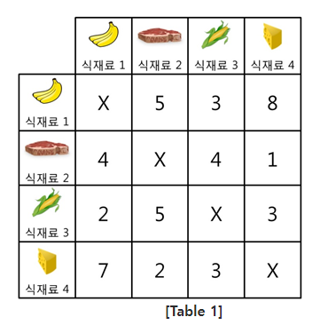
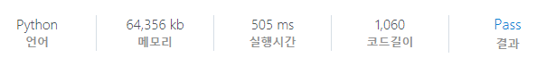

# [SWEA] 4012. [모의 SW 역량테스트] 요리사

## 📚 문제

https://swexpertacademy.com/main/code/problem/problemDetail.do?contestProbId=AWIeUtVakTMDFAVH&categoryId=AWIeUtVakTMDFAVH&categoryType=CODE&problemTitle=4012&orderBy=FIRST_REG_DATETIME&selectCodeLang=ALL&select-1=&pageSize=10&pageIndex=1

---

원하는 음식을 선택하는 것이므로 조합이다.

음식을 선택하는 경우의 수를 생각해본다. 따라서 조합이다.



식재료가 네 개인 경우는 다음과 같다.

>0 0 1 1
>
>0 1 1 0
>
>0 1 0 1
>
>1 0 0 1
>
>1 0 1 0
>
>1 1 0 0

이 때 `0 0 1 1`과 `1 1 0 0`은 같다. 따라서 절반보다 큰 값은 다 제거한다.

따라서 왼쪽 끝이나 오른쪽 끝이나 한 쪽에 0만 들어가는 경우로 확인하면 된다.

마지막 뽑는 횟수를 제거하고 그 땐 0만 뽑는다고 생각하여 절반만 확인하도록 한다.

조합으로 고르면서 그 때의 음식을 visited에 담는다.

위처럼 절반을 고르는 함수를 구현하고, 맛 차이의 절댓값을 구하는 함수를 만든다.


주어진 음식 2차원 배열을 2중 for문을 돌며 i와 j 둘 다 선택했는지 visited 배열을 통해 확인한다.

어차피 둘 다 0일 때와 1일 때 각각 합해줘서 빼야 하니, 하나의 변수를 선언하고 둘 다 선택한 음식이면 더해주고, 둘다 고르지 않는 음식이면 빼준다.

그 절댓값을 구하여 global로 선언한 값보다 작으면 업데이트 해준다.

## 📒 코드

```python
def taste():    # 맛 차이의 절댓값
    global min_result
    result = 0
    for i in range(n):
        for j in range(n):
            if visited[i] and visited[j]:   # 고른 걸 더해주고
                result += arr[i][j]
            elif visited[i] == 0 and visited[j] == 0:   # 안 고른 걸 빼준다.
                result -= arr[i][j]
    min_result = min(min_result, abs(result))   # 최솟값으로 초기화
    return


def recur(cur, num):
    if num > n // 2:        # 절반을 넘게 고르는 경우는 종료
        return
                            # 0011 1100처럼 대칭되면 같으므로 가장 큰 자릿수가 0일 때만 뽑는다.
    if cur == n - 1:        # 절반을 고르면 taste()를 돌고 종료, 아니면 그냥 종료
        if num == n // 2:   # 절반을 고르는 경우만
            taste()
        return

    recur(cur + 1, num)     # 선택하지 않는 경우

    visited[cur] = 1
    recur(cur + 1, num + 1)     # 선택하는 경우
    visited[cur] = 0


t = int(input())
for tc in range(1, 1 + t):
    n = int(input())
    arr = [list(map(int, input().split())) for _ in range(n)]
    visited = [0 for _ in range(n)]
    min_result = 10000000
    recur(0, 0)
    print(f'#{tc} {min_result}')
```

## 🔍 결과


