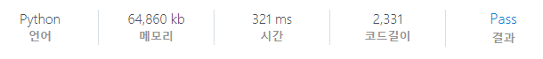

# [SWEA] 4311. 오래된 스마트폰

## 📚 문제 : [오래된 스마트폰](https://swexpertacademy.com/main/code/problem/problemDetail.do?contestProbId=AWL2vlPKMlQDFAUE&categoryId=AWL2vlPKMlQDFAUE&categoryType=CODE&problemTitle=4311&orderBy=FIRST_REG_DATETIME&selectCodeLang=ALL&select-1=&pageSize=10&pageIndex=1)

## 📖 풀이

A형 특유의 구현문제이다.

문제 구현 시 특이사항은 다음과 같다.

>- 음수거나, 999를 넘어가면 문제가 발생한다.
>
>- 연산 결과가 나오기 위해서는 무조건 `=`를 입력(연산하는 경우 마지막에만 =를 붙이면 된다.)
>
>- 직접 숫자를 입력하여 만드는 경우는 `=`를 입력하지 않는다.
>
>- 계산기 입력제한이 있어 터치 가능 최대 횟수는 M이다. (M은 20까지)
>
>- 곱셈 나누기가 덧셈 뺄셈보다 우선적으로 실행되지 않고 순차적으로 실행된다.


먼저 0~1000인 배열을 만든다. 나는 이름을 visited로 지었다. 이 배열에는 그 수를 완성하기 위한 가장 최소의 클릭 횟수를 담을 것이다.

연산자 없이 누를 수 있는 숫자들로 만들 수 있는 숫자들을 먼저 다 찾는다.

숫자만 넣는 경우는 자릿수만큼을 위에서 만든 visited 배열에 담아준다.

이 때, 0으로 시작하는 경우를 처리하기 위해 visited에 넣어 있는 값보다 크거나 같은 값은 넣지 못하도록 처리한다.

순열을 활용해 값을 찾아준다.

visited 배열에도 담고 nums라는 배열에도 담아준다. nums는 세자리 이하로 만들 수 있는 숫자들을 다 담아줄 것이다.

그러면 이후 연산자를 사용해 연산 값을 넣어줄 때 nums에 있는 숫자들과 계산해 줄 것이다.

숫자들만으로 원하는 숫자를 만들었으면 바로 출력한다.(`=`를 사용하지 않으니 visited 값만 출력하면 된다.)

큐를 활용해 시간을 절약한다.

위에서 구한 세자리 이하의 수들을 큐에 다 담아주고, 하나씩 꺼내 연산해준다. 연산한 결과가 visited에 있는 값보다 작을 때만 넣어주고 그 결과를 다시 큐에 담아준다.

가지치기는 아래와 같이 시행했다.

- 숫자들과 연산자를 누른 횟수가 m보다 큰 경우는 연산하지 않는다.

그리고 연산할 때 0으로 나눈 경우나 음수나 1000이상인 수가 되는 경우는 -1을 리턴하도록 해 예외사항을 처리해주었다.

큐에 남는 수가 없는 경우 종료하고 값을 출력한다.

값에 INF가 그대로 들어있는 경우는 원하는 수를 출력할 수 없는 경우이므로 -1을 출력한다.

[12094. 오래된 스마트폰](https://swexpertacademy.com/main/code/userProblem/userProblemDetail.do?contestProbId=AXnw5dtKhhIDFARX)는 deque를 사용할 수 있다.

4311번은 deque를 사용할 수 없으므로 deque 대신 list를 사용하고 `popleft()`대신 `pop(0)`을 사용했다.

## 📒 코드

```python
from collections import deque


def calc(num, num2, oper):      # 하나의 연산자를 이용한 계산 하나
    if oper == 1:      # 덧셈
        num += num2
    elif oper == 2:    # 뺄셈
        num -= num2
    elif oper == 3:    # 곱셈
        num *= num2
    else:               # 나눗셈
        if num2 == 0:   # 나눌 수 없는 경우
            return -1
        num //= num2
    if 0 <= num < 1000:     # 세자리까지 가능(음수 X)
        return num
    else:                   # 범위를 넘어서는 경우
        return -1


def recur(cur, x):     # 숫자버튼으로 만들 수 있는 수(세 자리 이하)
    if cur == 3:
        return
    for num in num_keys:
        nxt_num = x * 10 + num
        if visited[nxt_num] <= cur + 1:      # 0으로 시작하는 경우를 처리!
            continue
        visited[nxt_num] = cur + 1      # 클릭 횟수를 배열에 담는다.
        que.append(nxt_num)             # 큐에 담는다.
        nums.append(nxt_num)            # 숫자들을 담아준다.
        recur(cur + 1, nxt_num)


t = int(input())
for tc in range(1, t + 1):
    n, o, m = map(int, input().split())     # n: 터치가능한 숫자들의 개수, o: 터치가능한 연산자들의 개수, m: 최대 터치 횟수
    num_keys = list(map(int, input().split()))      # 사용 가능한 숫자들 0 ~ 9
    opers = list(map(int, input().split())) # 사용 가능한 연산자들 +는 1, -는 2, *은 3, /는 4
    nums = []
    w = int(input())        # 원하는 출력 값
    INF = m + 1             # m은 최대 20이니 더 큰 값을 넣어준다.
    visited = [INF for _ in range(1000)]
    que = deque()
    recur(0, 0)     # 숫자로만 구성할 수 있는 세자리 이하 수들을 담아준다.

    if visited[w] < INF:     # 숫자로만 구성할 수 있으면 출력하고 종료
        print(f'#{tc} {visited[w]}')
        continue

    while que:
        v = que.popleft()
        for num in nums:
            click_cnt = visited[v] + len(str(num)) + 1
            if click_cnt + 1 > m:           # 클릭 횟수가 m을 초과한 경우('='하나 포함)
                continue
            for oper in opers:
                nxt = calc(v, num, oper)
                if nxt == -1:           # 예외사항 처리
                    continue
                if visited[nxt] <= click_cnt:   # 클릭 횟수가 같거나 커지면 패스
                    continue
                visited[nxt] = click_cnt        # 클릭 횟수가 더 작으면 업데이트
                que.append(nxt)

    if visited[w] < INF:     # 숫자로만 구성할 수 있으면 출력하고 종료
        print(f'#{tc} {visited[w] + 1}')    # '='도 누르는 횟수 포함
    else:
        print(f'#{tc} -1')
```

## 🔍 결과

