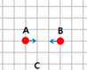
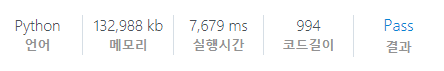

# [SWEA] 5648. [모의 SW 역량테스트] 원자 소멸 시뮬레이션

## 📚 문제

구현 문제이다.

좌표값만 기억해주며 만나는지 확인해준다.

만나지 않고 좌표 밖으로 나가거나, 하나 이하 남으면 종료한다.

좌표가 -1000부터 1000까지이다. 따라서 1000을 더해서 음수를 없애준다.



위 그림처럼 홀수 거리 차이가 있는 경우는 1.5 씩 움직여야 만난다. 따라서 0.5로 움직이지않고, 크기를 2배 늘려서 확인한다. 좌표값을 1000을 더한 후 2를 곱해 0 ~ 4000으로 사용한다.


원자들의 처음 위치와 방향, 에너지를 atoms 배열에 담아준다.

atoms에 원자가 2개 이상있으면 계속 반복문을 돌려준다.


원자들의 다음 위치 값을 loc 배열에 담아준다.

loc 배열에 담을 위치가 있으면 충돌한 것이니 hit 세트 자료형에 담아준다.

똑같은게 여러번 담기면 hit에 담는데 중복을 처리해주니 또 담아줘도 하나만 담기게되니 상관없다.

새로운 위치와 방향 에너지를 nxt_atoms 배열에 담아준다.

그리고 nxt_atoms를 순회하며 hit에 좌표가 있으면 에너지를 total에 더해주고, 없다면 다시 원자 배열에 담아 반복문을 돌린다.

위 과정을 반복한다.

## 📒 코드

```python
dx = [0, 0, -1, 1]  # 상 하 좌 우
dy = [1, -1, 0, 0]
for tc in range(1, 1 + int(input())):
    n = int(input())
    atoms = []
    for i in range(n):
        x, y, d, k = map(int, input().split())
        x = (x + 1000) * 2              # 음수 좌표를 양수로 넓히고,
        y = (y + 1000) * 2              # 0.5씩 이동시키지말고, 배열을 2배 늘리고 1씩 이동시킨다.
        atoms.append([x, y, d, k])      # 원자들의 상태를 담을 배열

    total = 0
    while len(atoms) >= 2:      # 2개 이상이어야 충돌한다.
        loc = []                # 이동하는 위치 기억(충돌 확인을 위함)
        hit = set()             # 충돌되는지 확인
        nxt_atoms = []          # 이동한 원자들의 상태를 담을 배열
        for i in range(len(atoms)):
            x, y, d, k = atoms[i]
            nx = x + dx[d]
            ny = y + dy[d]
            if 0 <= nx <= 4000 and 0 <= ny <= 4000:     # 배열의 크기를 넘으면 제거한다.
                if (nx, ny) in loc:     # 동일 위치가 또 나오면 충돌!
                    hit.add((nx, ny))
                else:                   # 아니면 위치를 새로 추가
                    loc.append((nx, ny))
                nxt_atoms.append((nx, ny, d, k))    # 원자들의 다음 상태들을 담아준다.
        atoms = []          # 사용할 원자 배열을 초기화
        for i in range(len(nxt_atoms)):     # 이동한 원자들을 순회
            x, y, d, k = nxt_atoms[i]
            if (x, y) in hit:               # 부딪힌 위치에 있으면 total에 k를 더한다.
                total += k
            else:                           # 안 부딪혔으면 원자 배열에 담아준다.
                atoms.append((x, y, d, k))
    print(f'#{tc} {total}')


```

## 🔍 결과

