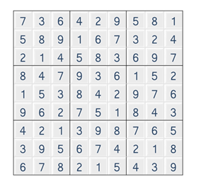

# [SWEA] 1974. 스도쿠 검증 [D2]

## 📚 문제

https://swexpertacademy.com/main/code/problem/problemDetail.do?contestProbId=AV5Psz16AYEDFAUq&categoryId=AV5Psz16AYEDFAUq&categoryType=CODE&problemTitle=1974&orderBy=FIRST_REG_DATETIME&selectCodeLang=ALL&select-1=&pageSize=10&pageIndex=1

---

**세트 자료형**을 활용한다.

1~9까지 있는지 확인하기 위해 세트에 담아 길이가 9를 출력하는지 확인한다.

중복되어 없는 값이 있으면 세트의 길이가 9가 되지 않는다.

우선 퍼즐을 2차원 배열로 받아온다.



1. 맨 위 row의 원소를 세트에 담아 확인하고 아래로 내려가며 확인한다.

2. 맨 왼쪽 column의 원소를 세트에 담아 확인하고 오른쪽으로 움직이며 column을 확인한다.

3. 3x3 박스가 9인지 확인하기 위해 맨 왼쪽 위의 인덱스에서 오른쪽으로 두번, 아래로 두번 움직이며 9칸 탐색한다.

1, 2는 같은 for문에 담아 사용할 수 있다.

## 📒 코드

```python
T = int(input())
for tc in range(1, 1+T):
    arr = [list(map(int, input().split())) for _ in range(9)] # 입력받은 스도쿠 퍼즐
    result = 1  # 중간에 문제 
    for i in range(9):  # row, column 탐색
        row_set = set() # row의 숫자를 담을 set
        col_set = set() # column의 숫자를 담을 set
        for j in range(9):  # 숫자를 담는다.
            row_set = row_set | {arr[i][j]} 
            col_set = col_set | {arr[j][i]}
        if len(row_set) != 9 or len(col_set) != 9:  # 1~9중 하나라도 중복되면 길이가 9가 나오지 않음을 이용
            result = 0
            break
    if result:  # 위에서 만족시키지 못한 경우가 나오면 네모 탐색을 하지 않는다.
        for i in range(3):  #3X3 네모 탐색
            for j in range(3):
                num_set = set()
                for k in range(3*i, 3*i+3): # 네모의 맨 왼쪽 위 인덱스부터 3x3 네모모양을 탐색
                    for l in range(3*j, 3*j+3):
                        num_set = num_set | {arr[k][l]}
                if len(num_set) != 9:
                    result = 0
                    break
    print(f'#{tc} {result}')
```

## 🔍결과 : Pass

