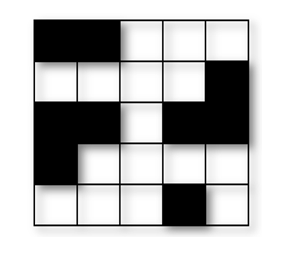
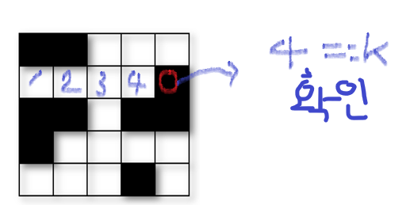
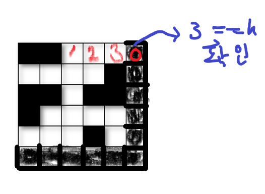

# [SWEA] 1979. 어디에 단어가 들어갈 수 있을까 [D2]

## 📚 문제

https://swexpertacademy.com/main/code/problem/problemDetail.do?contestProbId=AV5PuPq6AaQDFAUq&categoryId=AV5PuPq6AaQDFAUq&categoryType=CODE&problemTitle=1979&orderBy=FIRST_REG_DATETIME&selectCodeLang=ALL&select-1=&pageSize=10&pageIndex=1

---

단어 퍼즐 빈공간에 K길이의 단어퍼즐을 넣을 수 있는 공간이 몇 개 있는지 묻는 문제이다.

가로와 세로로 넣을 수 있으니 이중 for문에서 i,j를 바꿔 가로와 세로를 한 번에 찾아준다.

0이 글자가 존재할 수 없는 영역이고 1이 존재할 수 있는 영역이다.



위 그림에서 검정이 0, 흰색이 1이다.

1을 만나면 1씩 카운트하고, 0을 만나면 카운트된 총 1의 개수가 K개랑 같은지 확인한다. 그리고 0으로 초기화한다.



이렇게 해주면 맨 마지막 인덱스가 1일 때는 확인할 수 없으니 단어퍼즐의 크기를 NxN에서 (N+1)X(N+1)로 바꿔서 해결한다.



위 그림은 스도쿠의 col 마지막 인덱스가 1인 경우 테두리를 0으로 채워 해결해주는 모습이다.

## 📒 코드

```python
T = int(input())
for tc in range(1, 1+T):
    N, K = map(int, input().split())    # NxN 개의 퍼즐, 단어 길이 K
    arr = [list(map(int, input().split()))+[0] for _ in range(N)]   # 퍼즐의 오른쪽에 0추가
    arr += [list(0 for _ in range(N+1))]    # 퍼즐의 아래에도 0추가
    result_cnt = 0  # 특정 길이를 넣을 수 있는 개수
    # 0을 만나면 그 전에 1이 몇개 있는지 확인한다.
    # 인덱스 마지막도 확인해주기 위해 퍼즐 오른쪽, 아래로 0을 추가해주었다.
    for i in range(N):
        row_cnt = 0 # row열에서 연속된 1의 개수
        col_cnt = 0 # col열에서 연속된 1의 개수
        for j in range(N+1):
            if arr[i][j] == 0:  # 0을 만나면 그 전에 1이 연속으로 몇 개 있었는지 확인
                if row_cnt == K:    # K개 있었으면 result 증가
                    result_cnt += 1
                row_cnt = 0     # 0을 만났으니 cnt를 0으로 초기화
            else: row_cnt += 1  # 1을 만나면 cnt에 1추가
            if arr[j][i] == 0:  # 세로도 위처럼 한다.
                if col_cnt == K:
                    result_cnt += 1
                col_cnt = 0
            else: col_cnt += 1
    print(f'#{tc} {result_cnt}')
```

## 🔍 결과 : Pass

