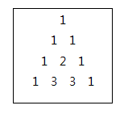

# [SWEA] 2005. 파스칼의 삼각형 [D2]

## 📚 문제

https://swexpertacademy.com/main/code/problem/problemDetail.do?contestProbId=AV5P0-h6Ak4DFAUq&categoryId=AV5P0-h6Ak4DFAUq&categoryType=CODE&problemTitle=%ED%8C%8C%EC%8A%A4%EC%B9%BC%EC%9D%98+%EC%82%BC%EA%B0%81%ED%98%95&orderBy=FIRST_REG_DATETIME&selectCodeLang=ALL&select-1=&pageSize=10&pageIndex=1

---

다음과 같은 크기가 N인 파스칼 삼각형을 만드는 문제이다.



이 경우는 사실 최대 10줄만 출력하므로 그럴 필요는 없지만, 배운 내용을 바탕으로 이전의 값을 저장해서 재활용하여 만들어 본다.(memorization)

현재 저장되어있는 줄보다 많은 걸 출력할 때는 그 줄에 도달할 때까지 반복문을 통해 새로 줄을 만들어 주고, 현재 저장되어있는 줄이 더 적으면 저장된 값을 바로 출력한다.

새로운 줄을 만들 때는 양 옆에 1을 붙이고 그 전의 줄에서 앞에서부터 인덱스를 세며 두 수를 더하는 방식으로 만든다.

## 📒 코드

```python
T = int(input())
memo = [[1], [1, 1]] # 파스칼 삼각형의 위부터 순차적으로 채운다.
for tc in range(1, T + 1):
    N = int(input())    # 출력시킬 줄의 수
    while len(memo) < N: # 준비된 줄보다 출력시킬 줄이 많으면 반복문을 수행
        l = len(memo)    # 현재 출력가능한 줄의 수
        # 다음 출력시킬 줄을 추가할 배열
        small_arr = [1]   # 왼쪽은 1을 붙인다.
        for i in range(0, l - 1):
            # 전 줄을 이용해 다음 줄을 추가한다.
            small_arr.append(memo[l - 1][i] + memo[l - 1][i + 1])
        small_arr.append(1)     # 오른쪽에도 1을 붙인다.
        memo.append(small_arr)   # 배열에 추가해준다.
    print(f'#{tc}')
    for i in range(N):  # 원하는 줄의 개수를 출력한다.
        print(*memo[i])
```

## 🔍 결과 : Pass