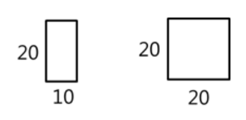
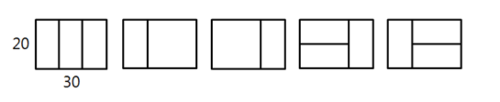
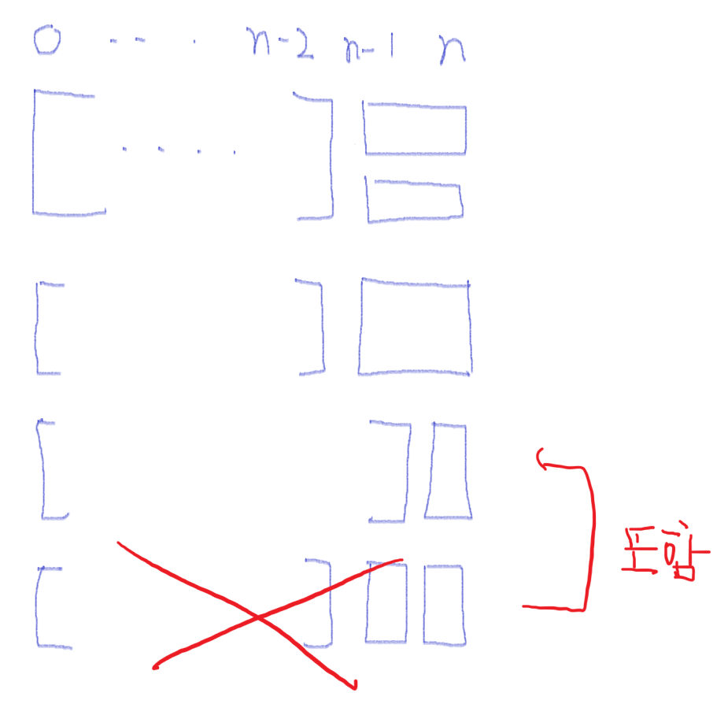

# [SWEA] 4869. [파이썬 S/W 문제해결 기본] 4일차 - 종이붙이기 [D2]

## 📚 문제

> 어린이 알고리즘 교실의 선생님은 경우의 수 놀이를 위해, 그림처럼 가로x세로 길이가 10x20, 20x20인 직사각형 종이를 잔뜩 준비했다.
>
>
>  
>
> 그리고 교실 바닥에 20xN 크기의 직사각형을 테이프로 표시하고, 이 안에 준비한 종이를 빈틈없이 붙이는 방법을 찾아보려고 한다. N이 30인 경우 다음 그림처럼 종이를 붙일 수 있다.
>
>
> 
>
> 
> 10의 배수인 N이 주어졌을 때, 종이를 붙이는 모든 경우를 찾으려면 테이프로 만든 표시한 영역을 몇 개나 만들어야 되는지 계산하는 프로그램을 만드시오. 직사각형 종이가 모자라는 경우는 없다.
>
>
> 
> **[입력]**
>
> 첫 줄에 테스트 케이스 개수 T가 주어진다. 1≤T≤50
> 다음 줄부터 테스트 케이스 별로 N이 주어진다. 10≤N≤300, N은 10의 배수
>
> **[출력]**
>
> 각 줄마다 "#T" (T는 테스트 케이스 번호)를 출력한 뒤, 답을 출력한다.

N번째의 개수를 구할 때 N-2번째의 개수와 N-1번째의 개수를 생각하여 구해볼 수 있다.



위 그림을 보면 첫번째 케이스와 두번째 케이스를 참고해 N-2 번째의 총 개수에 2를 곱한만큼의 경우의 수가 나옴을 알 수 있다.

그리고 세번째 케이스를 보면 N-1에 세로 막대 하나 더한 경우가 있으니 N-1의 경우의 수를 더해주면 된다.

마지막 네번째 케이스는 어차피 세번째 케이스에 포함되니 셀 필요가 없다.

> f(N) = 2 * f(N-2) + f(N-1)

점화식으로 반복되므로 재귀나 DP를 사용할 수 있다. DP를 활용하여 하나씩 memo라는 답을 담아 준다.

## 📒 코드

```python
T = int(input())
memo = [0, 1, 3]    # 재귀 대신 DP 활용
for tc in range(1, T + 1):
    N = int(input()) // 10
    while N >= len(memo):   # 배열에 출력시킬 값이 없으면 출력시킬 수 있게 추가해준다.
        # n-2 배열에 가로로 작은 사각형 두 개 쌓거나 큰 사각형 쌓는 방법이 있으니 *2를 해준다.
        # n-1 배열에 세로로 작은 사각형 하나 쌓는 방법이 있다.
        memo.append(memo[len(memo)-2] * 2 + memo[len(memo)-1])
    print(memo[N])
```

## 🔍 결과 : Pass