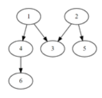

# [SWEA] 4871. [파이썬 S/W 문제해결 기본] 4일차 - 그래프 경로 [D2]

## 📚 문제

> V개 이내의 노드를 E개의 간선으로 연결한 방향성 그래프에 대한 정보가 주어질 때, 특정한 두 개의 노드에 경로가 존재하는지 확인하는 프로그램을 만드시오.
>
> 두 개의 노드에 대해 경로가 있으면 1, 없으면 0을 출력한다.
>  
>
> 예를 들어 다음과 같은 그래프에서 1에서 6으로 가는 경로를 찾는 경우, 경로가 존재하므로 1을 출력한다.
>
> 
>
> 노드번호는 1번부터 존재하며, V개의 노드 중에는 간선으로 연결되지 않은 경우도 있을 수 있다.
>  
>
> **[입력]**
>  
>
> 첫 줄에 테스트 케이스 개수 T가 주어진다. 1≤T≤50
>  
>
> 다음 줄부터 테스트 케이스의 첫 줄에 V와 E가 주어진다. 5≤V≤50, 4≤E≤1000
>  
>
> 테스트케이스의 둘째 줄부터 E개의 줄에 걸쳐, 출발 도착 노드로 간선 정보가 주어진다.
>  
>
> E개의 줄 이후에는 경로의 존재를 확인할 출발 노드 S와 도착노드 G가 주어진다.
>
>  
>
> **[출력]**
>  
>
> 각 줄마다 "#T" (T는 테스트 케이스 번호)를 출력한 뒤, 답을 출력한다.

Stack을 이용한 DFS문제이다.

간선으로 연결된 정점들의 관계를 2차원 배열에 표현한다.

한 정점에서 연결된 것을 인접리스트 형태로 만들었다.

방문하지 않은 정점들은 visited를 확인하며 확인해준다.

DFS가 다 탐색하는 것과 다르게 원하는 도착점에 도달하면 반복문을 끝내고 출력하게끔 설정하였다.

## 📒 코드

```python
T = int(input())
for tc in range(1, T + 1):
    V, E = map(int, input().split())
    arr = [set() for _ in range(V+1)]       # 인접리스트를 set로 표현
    for i in range(E):
        s, e = map(int, input().split())    # 정점 -> 정점을 arr에 넣는다
        arr[s].add(e)
    visited = [0 for _ in range(V+1)]       # 나왔는지 확인
    s, e = map(int, input().split())        # 확인할 경로의 출발점과 도착점
    stack = [s]     # stack에 출발점을 넣는다.

    while stack and visited[e] == 0:        # stack이 없거나 원하는 도착점까지 도달했는지 확인
        v = stack.pop()
        if not visited[v]:                  # 방문하지 않는 정점만 확인
            visited[v] = 1                  # 방문했음을 표시
            for v2 in arr[v]:               # 정점에서 연결된 정점들을 순회
                if not visited[v2]:         # 방문하지 않은 정점을 방문
                    stack.append(v2)        # stack에 담는다.

    if visited[e]:                          # 원하는 정점에 방문했는지 체크
        print(f'#{tc} 1')
    else:
        print(f'#{tc} 0')
```

## 🔍 결과 : Pass