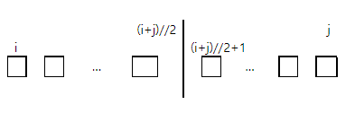
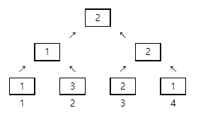

# [SWEA] 4880. [파이썬 S/W 문제해결 기본] 5일차 - 토너먼트 카드게임 [D2]

## 📚 문제

> 사다리 게임이 지겨워진 알고리즘 반 학생들이 새로운 게임을 만들었다. 가위바위보가 그려진 카드를 이용해 토너먼트로 한 명을 뽑는 것이다. 게임 룰은 다음과 같다.
>  
>
> 1번부터 N번까지 N명의 학생이 N장의 카드를 나눠 갖는다. 전체를 두 개의 그룹으로 나누고, 그룹의 승자끼리 카드를 비교해서 이긴 사람이 최종 승자가 된다.
>
> 그룹의 승자는 그룹 내부를 다시 두 그룹으로 나눠 뽑는데, i번부터 j번까지 속한 그룹은 파이썬 연산으로 다음처럼 두개로 나눈다.
>
> 
>
> 두 그룹이 각각 1명이 되면 양 쪽의 카드를 비교해 승자를 가리고, 다시 더 큰 그룹의 승자를 뽑는 방식이다.
>
> 다음은 4명이 카드를 비교하는 경우로, 숫자 1은 가위, 2는 바위, 3은 보를 나타낸다. 만약 같은 카드인 경우 편의상 번호가 작은 쪽을 승자로 하고, 처음 선택한 카드는 바꾸지 않는다.
>
> 
>
> N명이 학생들이 카드를 골랐을 때 1등을 찾는 프로그램을 만드시오.

이진 탐색을 활용한 분할정복 문제이다. 분할정복 문제는 재귀로 자연스레 풀린다.

인덱스를 두 구간으로 쪼개면서 가위바위보를 붙이는 방식이다. 재귀를 활용해 하나씩 남으면 그 때부터 가위바위보를 시켜 최종적으로 1등만 남도록 코드를 작성한다.

토너먼트 함수를 만드는데 위 첫번째 사진을 활용하여 팀을 둘로 나눈다.

나눠질 때 양쪽 다 인덱스가 하나만 남으면 그 때부터 가위바위보를 한다.

## 📒 코드

```python
# 토너먼트 카드게임
def tournament(i, j):   # 대진 짜기
    if i == j:            # 1명 남았을 경우 => 가위바위보 하러 간다
        return i
    else:               # 조 편성하기
        left = tournament(i, (i+j)//2)
        right = tournament((i+j)//2+1, j)
        return win(left, right)


def win(i, j):              # 가위바위보
    if arr[i] == arr[j]:    # 비긴 경우
        return i
    elif arr[i] == 1:       # 가위를 낸 경우
        if arr[j] == 2:     # 가위 vs 바위
            return j
        else:               # 가위 vs 보
            return i
    elif arr[i] == 2:       # 바위를 낸 경우
        if arr[j] == 1:     # 바위 vs 가위
            return i
        else:               # 바위 vs 보
            return j
    else:                   # 보를 낸 경우
        if arr[j] == 1:     # 보 vs 가위
            return j
        else:               # 보 vs 바위
            return i


T = int(input())
for tc in range(1, 1 + T):
    N = int(input())
    arr = [0] + list(map(int, input().split()))
    print(f'#{tc} {tournament(1, N)}')
```

## 🔍 결과 : Pass