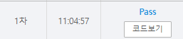

# [SWEA] 5185. [파이썬 S/W 문제해결 구현] 1일차 - 이진수 [D2]

## 📚 문제

https://swexpertacademy.com/main/learn/course/subjectDetail.do?courseId=AVuPDYSqAAbw5UW6&subjectId=AWUYDLaK1kMDFAVT#

---

## 📖 풀이

16진수를 2진수로 표현하는 문제이다.

16진수는 1~F까지 표현되므로 A부터 F는 딕셔너리를 이용해 바꾸어준다.

먼저 16진수를 10진수로 바꾸고 2진수로 바꾼다.

2진수로 바꿀 땐 2진수 앞자리 0도 출력해야하므로 4번 2로 나누면서 나머지를 출력한다.

## 📒 코드

```python
def ten_to_binary(n):           # 10진수를 2진수로 변환
    ans = ''
    for i in range(4):          # 4자리
        ans = str(n % 2) + ans  # 나머지를 왼쪽에 붙여준다.
        n //= 2
    return ans


def hex_to_binary(n):           # 16진수를 2진수로 변환(10진수로 바꾸고 2진수로 바꿔준다)
    ans = ''
    for c in n:                 # 입력받은 16진수 순회
        if c.isdigit():         # 숫자인 경우
            ans += ten_to_binary(int(c))
        else:                   # 문자인 경우 딕셔너리 활용
            ans += ten_to_binary(hex_c[c])
    return ans


hex_c = {'A': 10, 'B': 11, 'C': 12, 'D': 13, 'E': 14, 'F': 15}
for tc in range(1, 1 + int(input())):
    n, num = input().split()
    print(f'#{tc} {hex_to_binary(num)}')
```

## 🔍 결과

