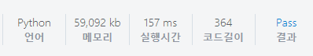

# [SWEA] 1206. View [D3]

## 📚 문제

링크 : https://swexpertacademy.com/main/code/problem/problemDetail.do?contestProbId=AV134DPqAA8CFAYh&categoryId=AV134DPqAA8CFAYh&categoryType=CODE&problemTitle=1206&orderBy=FIRST_REG_DATETIME&selectCodeLang=ALL&select-1=&pageSize=10&pageIndex=1&&&&&&&&&

---

빌딩을 하나씩 선택하면서 양 옆으로 -2, -1, 1, 2 떨어진 빌딩의 최고 높이와 비교해, 빌딩이 최고 높이보다 높으면 그 차이가 조망권 세대 수가 된다. 모든 빌딩에 적용한다.

쉽게 비교하기 위해 -2,-1,1,2를 list에 담아 활용한다.

## 📒 코드

```python
import sys
sys.stdin = open('input.txt')   # input.txt 불러오는 방법

T = 10  # 테스트 케이스 10개
location = [-2,-1,1,2]  # 빌딩 양 옆으로 2칸 씩 보기위해 리스트 지정

for tc in range(1, T+1):
    length = int(input())   # 리스트의 길이 입력
    arr = list(map(int, input().split()))
    jomang = 0  # 조망권 세대 수 합

    for i in range(2,length-2):
        top = 0 # 빌딩 거리 2 사이에서 가장 큰 빌딩의 높이 찾기, 초기화
        for loc in location:
            if arr[i+loc] > top:
                top = arr[i+loc]    # 가장 큰 빌딩으로 선택
        if arr[i] - top > 0: jomang += arr[i] - top # 조망권 세대를 합

    print(f'#{tc} {jomang}')    # 원하는 모양으로 출력
```

---

## 🔍 결과

