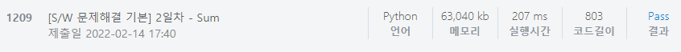

# [SWEA] 1209. [S/W 문제해결 기본] 2일차 - Sum [D3]

## 📚 문제

https://swexpertacademy.com/main/code/problem/problemDetail.do?contestProbId=AV13_BWKACUCFAYh&categoryId=AV13_BWKACUCFAYh&categoryType=CODE&problemTitle=1209&orderBy=FIRST_REG_DATETIME&selectCodeLang=ALL&select-1=&pageSize=10&pageIndex=1&&&&&&&&&

---

가로방향과 세로방향, 그리고 대각선으로 2방향의 합 중 최댓값을 출력하는 문제이다.

2차원 리스트를 다루기 익숙해지니 쉽게 접근할 수 있었다.

대각선 방향은 왼쪽 위에서 오른쪽 아래로 내려가는 방향으로 더해주었다.

그리고 왼쪽 아래에서 오른쪽 위로 올라가며 더해주었다.

## 📒 코드

```python
for _ in range(10):
    tc = int(input())
    arr = [list(map(int, input().split())) for _ in range(100)]
    max_sum = 0
    for i in range(100):
        row_sum = 0 # 가로방향 합 초기화
        col_sum = 0 # 세로방향 합 초기화
        right_down_sum = 0    # 왼쪽 위에서 오른쪽 아래 대각선 방향 합 초기화
        right_up_sum = 0    # 왼쪽 아래에서 오른쪽 위 대각선 방향 합 초기화
        for j in range(100):
            row_sum += arr[i][j]    # 가로방향 합
            col_sum += arr[j][i]    # 세로방향 합
        right_down_sum += arr[i][i]
        right_up_sum += arr[100-i-1][i]
        if max_sum < row_sum:
            max_sum = row_sum
        if max_sum < col_sum:
            max_sum = col_sum
    if max_sum < right_down_sum:
        max_sum = right_down_sum
    if max_sum < right_up_sum:
        max_sum = right_up_sum
    print(f'#{tc} {max_sum}')
```

## 🔍 결과


