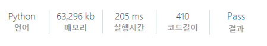

# [SWEA] 1221. [S/W 문제해결 기본] 5일차 - GNS [D3]

## 📚 문제

> 숫자 체계가 우리와 다른 어느 행성이 있다. 아래는 이 행성에서 사용하는 0 ~ 9의 값을 순서대로 나타낸 것이다.
>
> **"ZRO", "ONE", "TWO", "THR", "FOR", "FIV", "SIX", "SVN", "EGT", "NIN"**
>
> 0 ~ 9 의 값을 나타내는 단어가 섞여 있는 문자열을 받아 작은 수부터 차례로 정렬하여 출력하는 프로그램을 작성하라.
>
> 예를 들어 입력 문자열이 **"TWO NIN TWO TWO FIV FOR"** 일 경우 정렬한 문자열은 **"TWO TWO TWO FOR FIV NIN"** 이 된다.
>
> **[입력]**
>
> 입력 파일의 첫 번째 줄에는 테스트 케이스의 개수가 주어진다.
>
> 그 다음 줄에 #기호와 함께 테스트 케이스의 번호가 주어지고 공백문자 후 테스트 케이스의 길이가 주어진다.
>
> 그 다음 줄부터 바로 테스트 케이스가 주어진다. 단어와 단어 사이는 하나의 공백으로 구분하며, 문자열의 길이 N은 100≤N≤10000이다.
>
> **[출력]**
>
> \#부호와 함께 테스트 케이스의 번호를 출력하고, 공백 문자 후 정렬된 문자열을 출력한다.

**딕셔너리**를 사용해보았다.

문자를 key로 그 문자의 등장횟수를 각각의 key에 value로 넣어준다.

입력받은 문자들 중 해당 key의 value에 1씩 더해준 후 `ZRO`부터 순차적으로 출력한다.

key를 각각의 value 번만큼 출력시키기 위해 리스트에 key를 담아 `*`연산자로 반복시켜준다.

## 📒 코드

```python
# 딕셔너리 사용
T = int(input())
num_dict = {}   # 각각의 문자를 key로, 문자의 개수를 값으로 담을 딕셔너리
chr_lst = ["ZRO", "ONE", "TWO", "THR", "FOR", "FIV", "SIX", "SVN", "EGT", "NIN"]

for _ in range(T):
    tc, N = input().split()
    chrs = input().split()
    for c in chr_lst:   # 각각의 key 값을 입력하고 값은 0으로 초기화
        num_dict[c] = 0
    for c in chrs:  # 입력된 문자들과 같은 해당 key의 값에 1씩 개수를 추가해준다.
        num_dict[c] += 1
    sort_chrs = []  # 출력시킬 리스트
    for c in chr_lst:   # 딕셔너리의 key를 개수만큼 ZRO -> NIN 순서로 출력시킨다.
        sort_chrs += [c] * num_dict[c]
    print(tc)
    print(*sort_chrs)
```

## 🔍 결과

