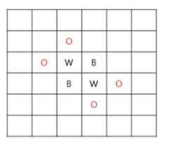
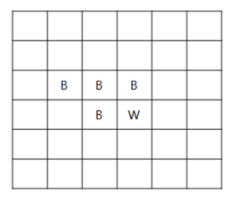

# [SWEA] 4615. 재미있는 오셀로 게임 [D3]

## 📚 문제

https://swexpertacademy.com/main/code/problem/problemDetail.do?contestProbId=AWQmA4uK8ygDFAXj&categoryId=AWQmA4uK8ygDFAXj&categoryType=CODE&problemTitle=4615&orderBy=FIRST_REG_DATETIME&selectCodeLang=ALL&select-1=&pageSize=10&pageIndex=1

---

추억의 오셀로 게임이다. 오목문제와 마찬가지로 델타 탐색을 활용해서 푼다.

오셀로 게임은 룰이 간단한데 내 돌이 다른 돌을 둘러쌓는 경우만 놓을 수 있고 둘러 쌓으면 내 돌의 색으로 바꾼다.

문제에 있는 예제 그림을 보면



다음과 같이 검정이 놓을 수 있는 곳은 4군데이고 검정을 놓으면,



둘러 쌓인 흰돌이 검정으로 바뀐다.

문제에서 돌을 놓는 경우를 알려주면 그 때에 맞추어 돌을 뒤집어 주면 된다.

따라서 돌의 가로 세로 대각선을 조회하며 총 8방향으로 탐색한다.

다른 색의 돌이 나오면 뒤집는다. 그러다가 끝에 내 돌과 같은 색의 돌이 나오면 중단한다.

뒤집다가 내 돌과 같은 색의 돌이 나오지 않으면 백트래킹을 활용해 다시 뒤집고 종료한다.

## 📒 코드

```python
import sys
sys.stdin = open("sample_input(1).txt")


def othello(color, x, y):    # 놓는 돌을 중심으로 8방향으로 다른 색의 돌이 있는지 확인
    for i in range(8):
        nx = x + dx[i]
        ny = y + dy[i]
        if 1 <= nx < n + 1 and 1 <= ny < n + 1 and arr[nx][ny] == 3 - color:
            change(color, x, y, i)  # 돌을 놓았으니 바꿔준다.


def change(color, x, y, direc):     # 백트래킹으로 돌의 색을 바꿔준다.
    nx = x + dx[direc]
    ny = y + dy[direc]
    if 1 <= nx < n + 1 and 1 <= ny < n + 1 and arr[nx][ny] == color:    # 놓은 돌이 나오면 stop
        return True
    if 1 <= nx < n + 1 and 1 <= ny < n + 1 and arr[nx][ny] == 3 - color:    # 다른 색의 돌이 나오면 바꾼다.
        arr[nx][ny] = color
        success = change(color, nx, ny, direc)
        if success == 0:        # 끝에 놓은 돌과 색이 같은 돌이 나오지 않았으면 되돌린다.
            arr[nx][ny] = 3 - color
            return False
    else:           # 돌이 없으면 되돌린다.
        return False


dx = [0, 1, 1, 1, 0, -1, -1, -1]    # 우, 우하, 하, 좌하, 좌, 좌상, 상, 우상
dy = [1, 1, 0, -1, -1, -1, 0, 1]
for tc in range(1, 1 + int(input())):
    n, m = map(int, input().split())
    arr = [[-1] * (n + 1) for _ in range(n + 1)]

    for i in range(n // 2, n // 2 + 2):     # 가운데 돌 4개를 놓는다.
        for j in range(n // 2, n // 2 + 2):
            arr[i][j] = 2 - (i + j) % 2

    for i in range(m):      # 돌을 하나씩 놓는다.
        x, y, color = map(int, input().split())
        arr[x][y] = color
        othello(color, x, y)    # 돌을 놓고 색을 바꿔준다.

    white, black = 0, 0     # 백돌과 흑돌의 개수
    for i in range(1, n + 1):
        for j in range(1, n + 1):
            if arr[i][j] == 1:
                black += 1
            if arr[i][j] == 2:
                white += 1
    print(f'#{tc} {black} {white}')
```

## 🔍 결과

