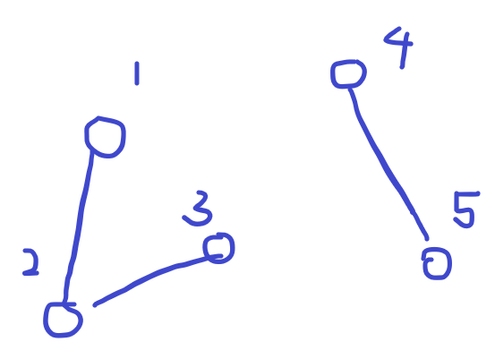
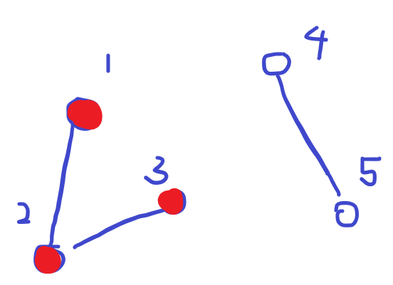
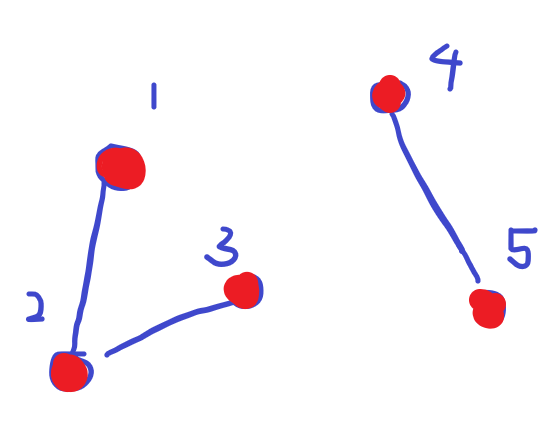

# [SWEA] 5248. [파이썬 S/W 문제해결 구현] 6일차 - 그룹 나누기 [D3]

## 📚 문제

https://swexpertacademy.com/main/learn/course/subjectDetail.do?courseId=AVuPDYSqAAbw5UW6&subjectId=AWUYG3y62EcDFAVT#

---

## 📖 풀이

연결 요소를 구하는 문제이다.

DFS나 BFS로 연결되어있는 요소를 찾아서 구할 수도 있고, Union - Find 알고리즘으로 연결되어있는 root를 하나로 합치면서 찾을 수도 있다.

DFS를 활용하여 연결 요소를 구해본다.

그림으로 설명해보면



위와 같이 연결된 간선이 주어진다고 해보자.

그러면 1번부터 순차적으로 방문했는지 확인한다.

방문하지 않았으면 DFS를 돌며 연결된 요소를 다 방문시키고 cnt를 1 증가시킨다.



cnt = 1

그리고 2랑 3을 확인할 땐 이미 방문표시 되어있으니 건너 뛴다.

그리고 4를 확인하면 또 DFS를 돌며 확인한다.



cnt = 2

5를 봤을 때 이미 방문표시 되어있으니 종료한다.

총 연결 요소의 개수는 2라는 걸 찾을 수 있다.

## 📒 코드

```python
# 연결 요소
def dfs(v):
    visited[v] = 1          # 방문 표시

    for nxt in graph[v]:    # 정점에서 연결된 정점들 순회
        if visited[nxt]:    # 방문하지 않는 정점들을 선택
            continue
        dfs(nxt)


t = int(input())
for tc in range(1, 1 + t):
    n, m = map(int, input().split())
    tmp = list(map(int, input().split()))
    graph = [[] for _ in range(n + 1)]  # 1번부터 n번까지

    for i in range(m):     # 무방향 그래프 연결 상태
        v1 = tmp[i * 2]
        v2 = tmp[i * 2 + 1]
        graph[v1].append(v2)
        graph[v2].append(v1)

    visited = [0 for _ in range(n + 1)]
    cnt = 0

    for i in range(1, n + 1):
        if visited[i]:  # 방문 확인
            continue
        dfs(i)      # 연결 요소를 다 방문 표시
        cnt += 1    # 연결 요소의 개수 + 1

    print(f'#{tc} {cnt}')
```

## 🔍 결과

