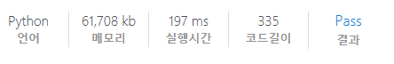
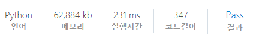

# [SWEA] 5356. 의석이의 세로로 말해요 [D3]

## 📚 문제

https://swexpertacademy.com/main/code/problem/problemDetail.do?contestProbId=AWVWgkP6sQ0DFAUO&categoryId=AWVWgkP6sQ0DFAUO&categoryType=CODE&problemTitle=5356&orderBy=FIRST_REG_DATETIME&selectCodeLang=ALL&select-1=&pageSize=10&pageIndex=1

---

입력된 문자열 중 문자열의 앞부터 열 순서대로 순차적으로 출력하는 문제이다.

문자열의 앞을 출력할 문자열에 하나씩 더해주고 제거한다.

문자열이 더 이상 존재하지 않다면 조건문으로 넘어간다.

모든 문자열이 없는 걸 확인하기 위해 cnt 변수를 활용해 출력한 문자열이 있는지 확인해준다.

## 📒 코드

```python
T = int(input())
for tc in range(1, 1+T):
    arr = [list(input()) for _ in range(5)]
    result = ''
    while True:
        cnt = 0
        for i in range(5):
            if len(arr[i]):
                result += arr[i][0]
                del arr[i][0]
                cnt += 1
        if cnt == 0: break
    print(f'#{tc} {result}')

```

## 🔍 결과



---

deque로 queue 자료구조를 활용해 풀어본다.

## 📒 코드

```python
# deque 활용
from collections import deque

T = int(input())
for tc in range(1, 1+T):
    arr = [deque(input()) for _ in range(5)]
    result = ''
    while True:
        cnt = 0
        for i in range(5):
            if len(arr[i]):
                result += arr[i].popleft()   
                cnt += 1
        if cnt == 0: break
    print(f'#{tc} {result}')
```

## 🔍 결과



예상과 다르게 실행시간은 더 길어졌다.. 그래도 deque를 한 번 활용해보았다.