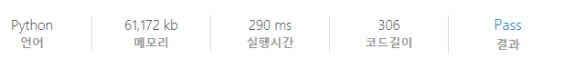

# [SWEA] 5688. 세제곱근을 찾아라 [D3]

## 📚 문제

https://swexpertacademy.com/main/code/problem/problemDetail.do?contestProbId=AWXVyCaKugQDFAUo&categoryId=AWXVyCaKugQDFAUo&categoryType=CODE&problemTitle=5688&orderBy=FIRST_REG_DATETIME&selectCodeLang=ALL&select-1=&pageSize=10&pageIndex=1

---

제곱근 구하던 것처럼, 1부터 순차적으로 확인하는데 `i * i * i` 보다 값이 커지면 종료한다.

그리고 `i * i * i`랑 주어진 정수와 값이 같으면 출력한다.

## 📒 코드

```python
t = int(input())
for tc in range(1, 1 + t):
    n = int(input())
    result = -1
    for i in range(1, n + 1):
        if i * i * i > n:  # 세제곱근보다 커지면 종료
            break

        if i * i * i == n:  # 같은 값이 있는지 확인
            result = i
            break

    print(f'#{tc} {result}')
```

## 🔍 결과

