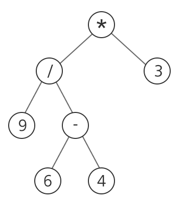
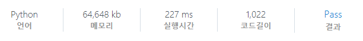

# [SWEA] 1232. [S/W 문제해결 기본] 9일차 - 사칙연산 [D4]

## 📚 문제

https://swexpertacademy.com/main/code/problem/problemDetail.do?contestProbId=AV141J8KAIcCFAYD&categoryId=AV141J8KAIcCFAYD&categoryType=CODE&problemTitle=1232&orderBy=FIRST_REG_DATETIME&selectCodeLang=ALL&select-1=&pageSize=10&pageIndex=1

---

**이진 트리** 문제이다.



다음과 같이 연산자와 숫자가 들어왔을 때 최종 계산 결과를 출력하는 프로그램이다.

리프 노드들을 서로 연산해줘야하니 후위 순회 방법을 활용한다.

배열에 부모와 자식 관계를 나타내지만 말고, 값도 함께 담아준다.

값이 연산자인 경우는 문자열이니 이를 주의하며 구현해야한다.

연산 과정에서는 실수 연산인 `/`를 사용하고 마지막에 `int()`로 형변환하여 정수로 바꿔준다.

## 📒 코드

```python
def recur(v):   # 후위 순회를 이용해 계산
    if arr[int(v)][0] not in '+-*/':    # 연산자가 아닌 경우
        return int(arr[int(v)][0])
    else:                               # 연산자인 경우
        a = recur(arr[int(v)][1])
        b = recur(arr[int(v)][2])

        if arr[int(v)][0] == '+':
            return a + b
        elif arr[int(v)][0] == '-':
            return a - b
        elif arr[int(v)][0] == '*':
            return a * b
        elif arr[int(v)][0] == '/':
            return a / b


for tc in range(1, 11):
    n = int(input())    # 정점의 수
    arr = [[0, 0, 0] for _ in range(n + 1)]     # 정점의 value, 자식 노드들
    temp = [input().split() for _ in range(n)]

    for i in range(n):
        if len(temp[i]) == 2:   # 리프 노드일 때, 숫자인 경우
            p, v = temp[i]
            arr[int(p)][0] = v
        else:                   # 연산자인 경우
            p, v, c1, c2 = temp[i]
            arr[int(p)] = [v, c1, c2]

    print(f'#{tc} {int(recur(1))}')     # 정수형으로 변환하여 출력
```

## 🔍 결과

