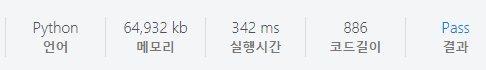

# [SWEA] 1249. 보급로 [D4]

## 📚 문제

https://swexpertacademy.com/main/code/problem/problemDetail.do?contestProbId=AV15QRX6APsCFAYD&categoryId=AV15QRX6APsCFAYD&categoryType=CODE&problemTitle=%EB%B3%B4%EA%B8%89%EB%A1%9C&orderBy=FIRST_REG_DATETIME&selectCodeLang=ALL&select-1=&pageSize=10&pageIndex=1

---

## 📖 풀이

현 위치부터 네 방향으로 탐색하며, 확인해나간다.

**BFS 탐색**으로 해결한다.

현재 값을 저장해놓아 더 큰 값이 들어오면 큐에 담지 않는 방법으로 가지치기해나간다.

따라서 초기값은 최소인지 비교해야 하므로 들어올 수 없는 큰 값으로 배열을 초기화한다.

큐에 (0, 0)을 담고 visited 배열의 (0, 0)에도 0을 담는다.

큐에서 값을 꺼내면 상하좌우 네 방향으로 탐색하며, 인덱스를 넘지 않고, visited의 값보다 작은 값이 나오는 경우 visited를 바꾸고 큐에 좌표를 담는다.

위 같은 방법으로 더 큰 값이 나오는 경우는 제거하면서 확인한다.

n-1, n-1에 도달하면 continue로 다음 정점으로 넘어간다.

## 📒 코드

```python
from collections import deque

dx = [0, 1, 0, -1]
dy = [1, 0, -1, 0]
t = int(input())
for tc in range(1, t + 1):
    n = int(input())
    arr = [list(map(int, input())) for _ in range(n)]
    visited = [[100000] * n for _ in range(n)]  # 나올 수 없는 아주 큰 값으로 초기화
    visited[0][0] = 0
    queue = deque()
    queue.append((0, 0))

    while queue:
        x, y = queue.popleft()
        if x == n - 1 and y == n - 1:   # 끝에 도달하면 continue
            continue
        for i in range(4):
            nx = x + dx[i]
            ny = y + dy[i]
            if 0 <= nx < n and 0 <= ny < n:
                if visited[nx][ny] > visited[x][y] + arr[nx][ny]:   # 더 작은 값일 때
                    visited[nx][ny] = visited[x][y] + arr[nx][ny]
                    queue.append((nx, ny))

    print(f'#{tc} {visited[n - 1][n - 1]}')
```

## 🔍 결과


---

## 📖 다익스트라 알고리즘 풀이

가중치를 활용한 다익스트라 알고리즘을 활용해서 풀어본다.

음수가 없으니 가능하다.

출발점만 0으로 거리값을 넣어주고 나머지는 INF 값으로 나올 수 없는 큰 값을 넣는다.

출발점을 힙에 넣고 힙에 더 이상 정점이 없으면 종료한다. 힙에는 거리를 첫 번째 인덱스로 넣어야 거리가 최소인 점부터 확인할 수 있다. 그리고 좌표 값을 넣어준다.

정점이 나오면 방문처리를 해주고, 힙에 값이 없어지면 방문처리가 모두 완료되고 끝이나게 된다.

정점에서 값이 나오면 상하좌우 네 방향을 탐색하고, 값을 바꿀 때 거리값이 더 작아지면 바꾼 후 힙에 넣어준다.

위 과정을 반복한다.

## 📒 코드

```python
# 다익스트라 알고리즘
import heapq

dx = [0, 1, 0, -1]
dy = [1, 0, -1, 0]
t = int(input())
for tc in range(1, t + 1):
    n = int(input())
    arr = [list(map(int, input())) for _ in range(n)]
    INF = 100000
    dist = [[INF] * n for _ in range(n)]  # 나올 수 없는 아주 큰 값으로 초기화
    visited = [[0] * n for _ in range(n)]   # 방문 표시
    dist[0][0] = 0

    heap = []   # 힙 활용
    heap.append((0, 0, 0))
    while heap:
        d, x, y = heapq.heappop(heap)
        if visited[x][y]:
            continue
        visited[x][y] = 1
        for i in range(4):
            nx = x + dx[i]
            ny = y + dy[i]
            if 0 <= nx < n and 0 <= ny < n:
                if dist[nx][ny] > d + arr[nx][ny]:  # 경유지 갱신
                    dist[nx][ny] = d + arr[nx][ny]
                    heapq.heappush(heap, (dist[nx][ny], nx, ny))
    print(f'#{tc} {dist[-1][-1]}')
```

## 🔍 결과



연결된 정점들이 적어서 힙을 활용한 다익스트라 알고리즘이 더 오래 걸린다.