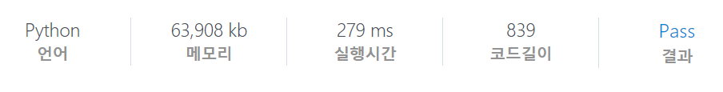

# [SWEA] 1249. 보급로 [D4]

## 📚 문제

https://swexpertacademy.com/main/code/problem/problemDetail.do?contestProbId=AV15QRX6APsCFAYD&categoryId=AV15QRX6APsCFAYD&categoryType=CODE&problemTitle=%EB%B3%B4%EA%B8%89%EB%A1%9C&orderBy=FIRST_REG_DATETIME&selectCodeLang=ALL&select-1=&pageSize=10&pageIndex=1

---

## 📖 풀이

현 위치부터 네 방향으로 탐색하며, 확인해나간다.

**BFS 탐색**으로 해결한다.

현재 값을 저장해놓아 더 큰 값이 들어오면 큐에 담지 않는 방법으로 가지치기해나간다.

따라서 초기값은 최소인지 비교해야 하므로 들어올 수 없는 큰 값으로 배열을 초기화한다.

큐에 (0, 0)을 담고 visited 배열의 (0, 0)에도 0을 담는다.

큐에서 값을 꺼내면 상하좌우 네 방향으로 탐색하며, 인덱스를 넘지 않고, visited의 값보다 작은 값이 나오는 경우 visited를 바꾸고 큐에 좌표를 담는다.

위 같은 방법으로 더 큰 값이 나오는 경우는 제거하면서 확인한다.

n-1, n-1에 도달하면 continue로 다음 정점으로 넘어간다.

## 📒 코드

```python
from collections import deque

dx = [0, 1, 0, -1]
dy = [1, 0, -1, 0]
t = int(input())
for tc in range(1, t + 1):
    n = int(input())
    arr = [list(map(int, input())) for _ in range(n)]
    visited = [[100000] * n for _ in range(n)]  # 나올 수 없는 아주 큰 값으로 초기화
    visited[0][0] = 0
    queue = deque()
    queue.append((0, 0))

    while queue:
        x, y = queue.popleft()
        if x == n - 1 and y == n - 1:   # 끝에 도달하면 continue
            continue
        for i in range(4):
            nx = x + dx[i]
            ny = y + dy[i]
            if 0 <= nx < n and 0 <= ny < n:
                if visited[nx][ny] > visited[x][y] + arr[nx][ny]:   # 더 작은 값일 때
                    visited[nx][ny] = visited[x][y] + arr[nx][ny]
                    queue.append((nx, ny))

    print(f'#{tc} {visited[n - 1][n - 1]}')
```

## 🔍 결과

